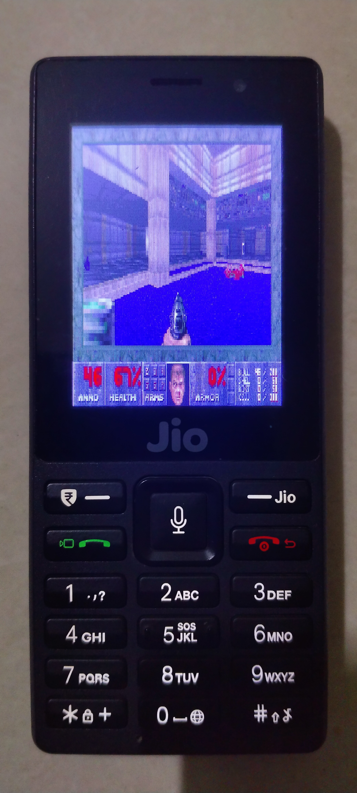

A few days ago, I found an old Jiophone. At first, it appeared to be a simple, locked down KaiOS device.
But after a day of tinkering around with it, I found myself running doom on it.

<!--more-->

Project's source (GPLv2): [doom_qualcomm-msm890x](https://github.com/sivaplaysmC/doom_qualcomm-msm890x/)

---

If your attention span is cooked (like mine) ~~don't skip to the [Final result](#final-result)~~

---

## Preface

The JioPhone (LYF F220B) is a Qualcomm MSM8909 device. It runs KaiOS 2.5 and has a bunch of
vendor specific apps installed on it.

Since it ran [KaiOS](https://github.com/kaiostech/gecko-b2g/) (fork of [boot2gecko](https://github.com/mozilla-b2g/B2G), aka b2g),
apps are just webpages - consisting of just HTML and CSS pages.

This phone **doesn't allow installing third-party apps**.
But there exist two options for _"sideload"-ing_ KaiOS webapps:

- By **modifying and reflashing** the `userdata.img` or `system.img` partitions
- By using an [**app called "OmniSD"**](https://sites.google.com/view/bananahackers/install-omnisd)

The second option involves flashing an untrusted ext4 partition to the device, so I ruled it out.

## Rooting the device (Ie, installing a backdoor)

TL;DR: Modify boot partition to **add a non-standard sshd service** running as root **accessible over wifi**.

Rooting this device involves extracting, modifying and reflashing partitions on the device.

Since this device has a Qualcomm processor (MSM8909), partitions can be edited using
"EDL mode" - a recovery environment that operates on a level lower than `fastboot`.

I put the device into EDL Mode by pressing the "*" key while plugging it to a USB port
while it's in the power-off state. Then, I used [this tool](https://github.com/bkerler/edl)
to interact with the device. It is also packaged in nixpkgs as [edl](https://search.nixos.org/packages?channel=25.11&query=android-tools)

Then, I extracted the android boot image and separated it into the `kernel` and `initramfs`
by using `unpack_bootimg`. The `initramfs` was a **gzip compressed CPIO** archive, so extracting
it was a walk-in-the-park.

To get a rootshell, I dropped a [reverse-ssh](https://github.com/Fahrj/reverse-ssh) binary
into `sbin/` in the initramfs. The binary is compiled for ARMv7, and cross compilation
was as easy as setting a few environment variables, thanks to Go's awesome (cross-) compiler features.

After adding the binary into the initramfs and making it executable, I added a service declaration
to `init.rc` which starts `reverse-ssh` as root. I also added `on` clause that started the service on
boot.

Once the changes were done, I repacked the bootimage using `mkbootimg` and flashed it onto the `boot` partition.
So, as soon as the device turns on, `reverse-ssh` is started as root user exposing a password protected rootshell.

Both `mkbootimg` and `unpack_bootimg` are available in nixpkgs as a part of the
[android-tools](https://search.nixos.org/packages?channel=25.11&query=android-tools) package.

### 🤓🤓 Just use `adb root` 🤓🤓

Thanks to my skill issues, I faced the following blockers while exposing adb with root privs over usb.

1.  I had a hard time enabling the developer menu in settings.

    I followed [this Banana Hackers blogpost](https://sites.google.com/view/bananahackers/install-omnisd/enable-adb-devtools)
    which involved binary-editing the filesystem image, and it took quite some time to enable the developer menu.

    Getting my `adb` server's pubkey into the userdata partition's trusted adbkeys took me an absurd amount of time

2.  `adb root` just didn't work

    `adb root` is used to get root access with `adb`. For some reason, it absolutely didn't work
    in my case.

    I guess it is because of some arcane property-kungfu like `ro.secure` or `ro.adb.secure`,
    but even after patching the properties by editing the system and userdata partitions,
    I couldn't get `adb root` to work. So I just went ahead with the `reverse-ssh` approach coz **YOLO**.

## Assessing Hardware Interfaces Before I "Doom" myself

### Drawing to the framebuffer

My objective for this phase was to fill the screen with **white**.
Since the kernel exposed `/dev/graphics/fb0`, I followed [this blog post by Kevin Boone](https://kevinboone.me/linuxfbc.html)
to draw to the screen. Unfortunately, it didn't work as the framebuffer driver
for this screen (mss_mdp) required special "nudges" for it to **actually draw the buffer to the screen**.

I referred to the KaiOS source for mitigating this issue instead of looking at the kernel sources.
For filling the screen with a blank color, after writing to the mapped framebuffer memory,
a [special IOCTL was issued](https://github.com/kaiostech/gecko-b2g/blob/gonk/widget/gonk/libdisplay/NativeFramebufferDevice.cpp#L310)
as a "nudge" to sync the mapped memory to the pixels in the screen.

After implementing it in my POC, I was able to clear the screen with a RGB565 color of my choice.

### Handling key input

Input handling was pretty straightforward. I opened `/dev/input/event0` (main keypad)
and `/dev/input/event1` (reject call button) with `O_NONBLOCK` and continuously polled
until it returned -1, caused by `EAGAIN`. This is very similar to how `SDL` handles userinput
with `SDL_PollEvent`.

## Porting (Pure)Doom

I chose [PureDOOM](https://github.com/Daivuk/PureDOOM/) as a base for my doom port.
This decision was mainly because of **reduced compilation complexity** - PureDOOM is a
*single-header doom implementation*, which meant I could include it in my project easily
without complex build steps.

It also makes running doom on weird targets like microwaves _very_ simple - you just have
to **implement a few functions** (malloc and free, file operations, gettime, puts...)
**and you have basic doom ready.**

PureDOOM returns a "palette-buffer" in doom's native resolution (320x200 pixesl),
where each pixel is an index into one of the color palettes.
I [patched the `I_SetPalette` function in the PureDOOM source](https://github.com/sivaplaysmC/doom_qualcomm-msm890x/blob/master/PureDOOM.h#L16474-L16498)
to pre-compute a RGB565 lookuptable for each color on the palette, and use
it to populate the screen framebuffer and scale the output to the device's resolution.

Once the framebuffer is filled, I nudge the driver to draw the framebuffer to the screen.

Handling input was straightforward - I ported my `/dev/input/event[0,1]` workbench into a input system
which calls `doom_key_up` and `doom_key_down` in response to physical key-presses.

## Final result

After wiring everything together - the framebuffer renderer, input handling,
and PureDOOM - the game booted up and ran on the JioPhone's 240×320 display.

It's not the smoothest experience - the small keypad makes navigation painful and awkward - **but it runs**.
And honestly, **that's the whole point.**

*Can it run Doom?* **Turns out, yes**. Even a locked-down feature phone from Jio can.

