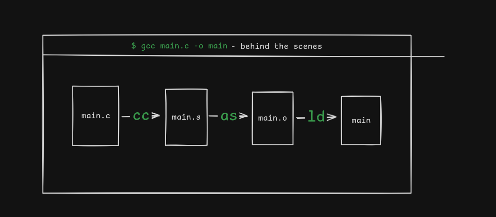
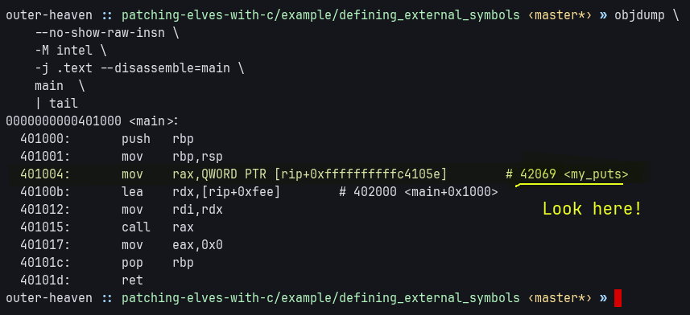
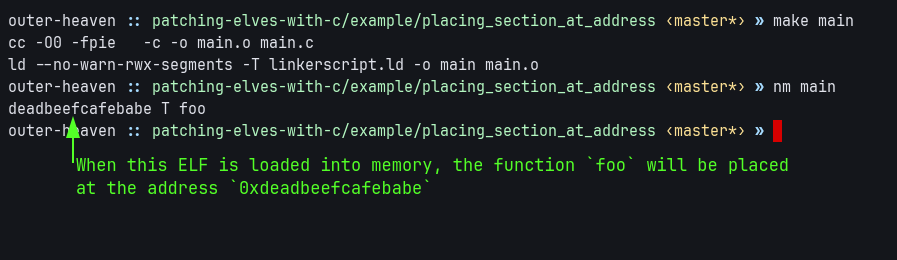
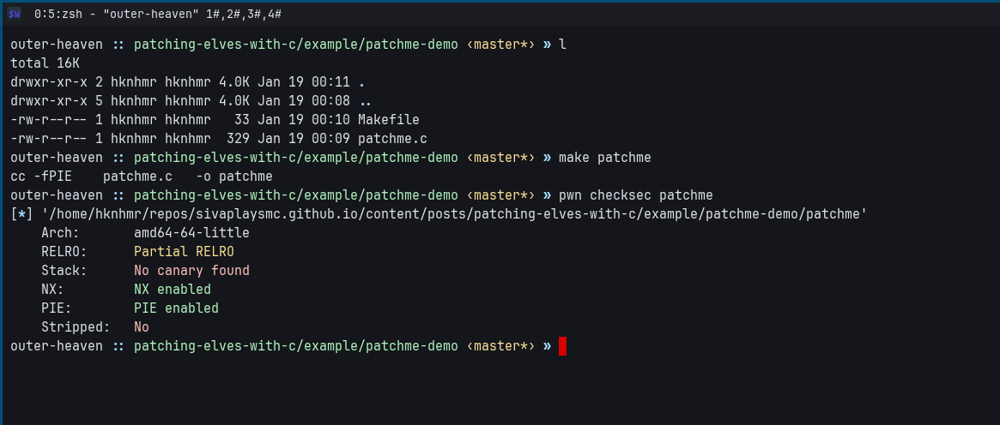
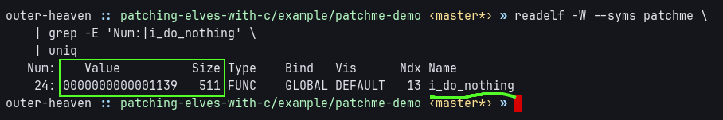
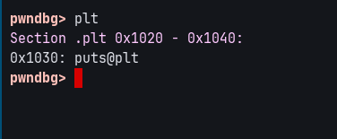
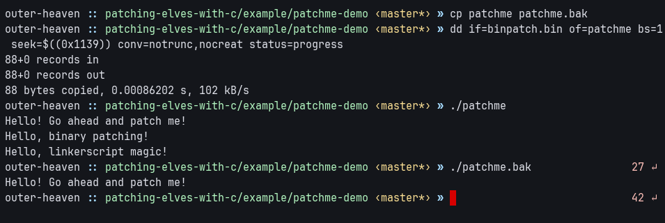

Using a little bit of linkerscript magic and C to patch binaries the toolchain-intended way - instead of manually patching assembly instructions like a madman.

<!--more-->

In this post, we'll explore an intuitive way to patch program behaviour in ELF binaries - by using a method that involves NO assembly.

## TL;DR

Feel free to skip to [Simple demonstration](#demonstration) section if you are familiar with C compilation process and linkerscript.

## Compiling C - a quick refresher

Compiling C, in the most simplest form, is as simle as a single command like `gcc main.c -o main`.

But behind the scenes, there's three main components involved in converting a C source file to an executable - the compiler, the assembler, the linker.



## Abusing the linker for fun and patching binaries

In the compilation process, the linker is used to resolve [relocations](https://en.wikipedia.org/wiki/Relocation_(computing)) in object files.

The **GNU Linker (ld)** provides two features that can be used for binary patching:

1.  Defining the address of a symbol.
2.  Placing a certain section of code at a certain memory offset.

### Defining the address of a symbol

In C, **symbols may be referenced before they are defined**. This allows code to refer to objects or functions whose final definition is provided later-either by another object file or by the linker itself.

Symbols defined in linkerscript can be referenced using the `extern` C keyword (It's not necessary for functions).

The below example shows a linkerscript which defines the address of the symbol `my_puts` to be `0x42069`.
It can be verified by looking at corresponding disassembly.

```c {title="main.c"}
extern void (*my_puts)(char *);

int main(void) {
  my_puts("Hello, world!");
}
```

```ld {title=linkerscript.ld}
INCLUDE default.ld

my_puts = 0x42069;
```



Feel free to download and compile the contents of [example/defining_external_symbols/export.zip](example/defining_external_symbols/export.zip) to verify.

### Placing a certain section of code at a certain memory offset

By modifying the location counter (the `.`) of a linkerscript, we can force certain sections to be placed in specific virtual addresses.

For example, the below code places the function `foo` at the **virtual address** `0xdeadbeefcafebabe`.

```c {title="patch.c"}
#define SECTION(x) __attribute__((section(x)))

// this section should be placed at **virtual address** `0xdeadbeefcafebabe`
SECTION(".patch")
int foo(void) {
    return 42;
};
```

```ld {title="patch.ld"}
SECTIONS
{
    . = 0xdeadbeefcafebabe;
    .patch ALIGN(1) : SUBALIGN(1)
    {
        KEEP (*(.patch))
    }
}
```



The source for this example is provided at: [example/placing_section_at_address/export.zip](example/placing_section_at_address/export.zip).

## Simple demonstration {id="demonstration"}

For a practical example, we will patch a binary produced by the following source:

```c {title=patchme.c}
#include <stdio.h>
#include <sys/cdefs.h>

volatile int i_do_nothing() {
  __asm__ volatile(".rept 500\n\t"
                   "nop\n\t"
                   ".endr\n\t");

  return 42;
}

int main(void) {
  puts("Hello! Go ahead and patch me!");
  volatile int ret = i_do_nothing();
  return ret;
}
```

The goal is to replace the code-cave `i_do_nothing` with a call to

```c
puts("Hello, binary patching!");
puts("Hello, linkerscript magic!");
```

without recompiling the original source.

The binary has the following protections enabled:



The most notable one, for our concerns, is **[PIE (Position Independent Executable)](https://one2bla.me/The-dark-arts/Exploit-mitigations/position-independent-executables)**.
Since it is enabled, we cannot call to absolute addresses - we have to make the compiler emit the `rel32` counterparts of the `call` / `jmp` instructions by setting a flag.

### Notation

Moving on, the word **"target"** refers to the binary being patched.

### Recon

Before we start writing the patch, we need to identify code caves and enumerate the environment.

####  We need a safe-to-patch code cave.

When patching a code cave, it **should not cause un-wanted side-effects** (like triggering improper memory access).

The `i_do_nothing` function provides a perfect code cave, with 500 nop instructions.
It starts at physical address `0x01139` and has a length of `511 bytes`.




####  We need to call external library functions

Our goal is to call `puts`.

Since the target is dynamically linked, we can find a reference to puts in the [`.plt` section](https://ir0nstone.gitbook.io/notes/binexp/stack/aslr/plt_and_got),
at the physical offset `0x1030`.



### Writing the patch {id="write-patch"}

From our recon, we have the following parameters:

1. should fit within the address range `[0x1139, 0x1139+511]`.
2. must call `puts`, which can be achieved using `puts@plt`.
3. must also embed two null-terminated strings (the parameters to `puts@plt`).

With the above in mind, one can write a patch - something similar to this:

```c {title="binpatch.c"}
#include <stdio.h> // for declaration of puts

#define SECTION(x) __attribute__((section(x)))

SECTION(".patch.data.string1")
const char hello_binary_patching[] = "Hello, binary patching!";

SECTION(".patch.data.string2")
const char hello_linkerscript[] = "Hello, linkerscript magic!";

SECTION(".patch.code.i_do_something")
void i_do_something() {
  puts(hello_binary_patching);
  puts(hello_linkerscript);
}
```

```ld {title="binpatch.ld"}
patch_at = 0x01139;
patch_size = 511;

puts = 0x1030; /* plt entry of puts */

SECTIONS
{
    . = patch_at;
    .patch ALIGN(1) : SUBALIGN(1)
    {
        KEEP(*(.patch.code.*))
        KEEP(*(.patch.data.*))
    }
    ASSERT(SIZEOF(.patch) <= patch_size, "patch is too big")
}
```

Once the patch is compiled and extracted, it can be applied to the target using the `dd` command.



## Caveats

1. If the codecave is restricted by size, it is a better idea to directly write assembly.
2. If the target function's calling convention differs from the C compiler's ABI, it's preferable to use a small assembly "stub" to adapt the arguments and invoke the C function correctly.

## Conclusion

The original goal of this method of binary patching **was to increase productivity** by working with a high level tool like the C compiler instead of an assembler.
That said, it also **comes with a few pretty useful side effects**. I’ll revisit the points outlined below in more detail in future posts:

1. With enough compiler options, it _should_ be possible to **use languages other than C** for generating object files. Example: Rust, Zig, Nim, etc.

2. The patch itself gains a degree of platform independence: as long as the target and the patching language
   share the same (or similar) ABI, the patch logic remains unchanged. The only platform-specific component is
   the linker script, which defines the required symbols, addresses, and offsets.

3. This method should work fairly unchanged for other binary formats, like
   [PE](https://learn.microsoft.com/en-us/windows/win32/debug/pe-format)s or
   [Mach-O](https://en.wikipedia.org/wiki/Mach-O) executables.

4. With a large enough code caves, it should be possible to embed a dynamic symbol-resolver, which uses
   platform dependent methods to load addresses of symbols from libraries
   (like `dlsym()` on linux, and `GetProcAddress()` on NT).

Overall, this method shifts binary patching away from instruction-level edits to a more structured, maintainable and versionable workflow.
It mirrors how decompilers let us think in C while reverse-engineering: the low-level complexity of assembly still exists,
but the compiler handles it for us, allowing us to focus on intent rather than instructions.
