Reversing a raw firmware dump is very different from reversing an ELF executable or a PE image. There are no sections, no symbols, and often no clear format - just raw bytes.

In this post, I’ll walk through the process of reversing a simple ARM Cortex-M3 (ARMv7-M) firmware image using Ghidra, mapping memory regions, identifying initialization routines, and making sense of global variables.

<!--more-->

## Who this is for

This guide is aimed at readers who:

1. Have a basic understanding of the ELF file format.
2. Know what common sections like .text, .data, and .bss are.
3. Don’t mind reading a bit of assembly along the way.

Even if you only tick one of these boxes, you should still be able to follow along.

## Why?

Firmware dumps are what you’ll encounter when dealing with embedded devices, capture-the-flag (CTF) challenges, or IoT security research. Unlike ELF binaries, firmware doesn’t come with headers or section tables to guide you - you have to reconstruct the structure yourself.

## What, How, and Why?

In this post, our focus will be a simple blink example made with [Opencm3](https://libopencm3.org/).

Download it here: [blink-led.bin](images/blink-led.bin) and [blink-led.elf](images/blink-led.elf)

I have also posted the accompanying ELF file, to get a speed boost.

**Opencm3** is an open-source firmware library that provides a lot of helper functions for peripherals (like GPIO, RCC, etc.) in a wide range of microcontrollers.

We'll be using [Ghidra](https://github.com/NationalSecurityAgency/ghidra/), as it is open source and I am familiar with it. You can follow along with Ida, Binary Ninja, or Radare2 if you are familiar with it - the techniques are the same, and the only difference is the sequence of mouse clicks.

## Reversing with Ghidra

### Importing the file

Create a new project in Ghidra, and import the firmware file.
The key here is to select the correct architecture for your firmware.
In this case, we'll be reversing firmware for an **ARM Cortex-M V7 32-Bit Firmware**, and hence we'll use it.

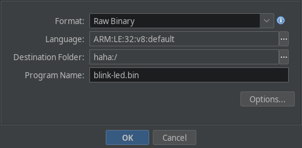


### Initial Steps

After importing the file, double click on it to open it in the codebrowser.

If Ghidra asks to auto-analyze it, press NO, as we have some initial massaging to do with the binary. But we will need auto analysis at a later point in time, tho.

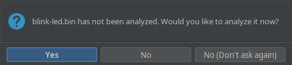

Once that is done, you should be looking at the listing. At this point, we can start with defining the memory maps for the firmware.

### Mapping the text section

Almost all embedded systems have the following sequence:

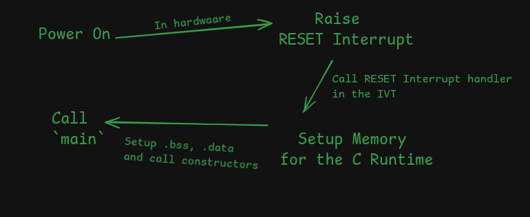

Which is very similar to how an ELF executable is loaded and executed:

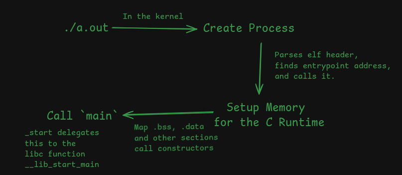

ELF executables contain a header which instructs the interpretter to put different sections at different places in memory.

In case of firmware, it has to be flashed to a specific place in the microcontroller's flash memory. It varies for different microcontrollers, so this part requires reading the documentation.

In our case, our code is flashed onto a [STM32 Blue Pill](https://robu.in/product/weact-studio-stm32f103c8t6-bluepill-plus-arm-stm32-minimum-system-development-board-module/) that uses an [STM32F101](https://www.st.com/en/microcontrollers-microprocessors/stm32f101c8.html) under the hood.

Since the [documentation](https://www.st.com/resource/en/datasheet/stm32f101c8.pdf) is available online, It was easy to find the right memory map.

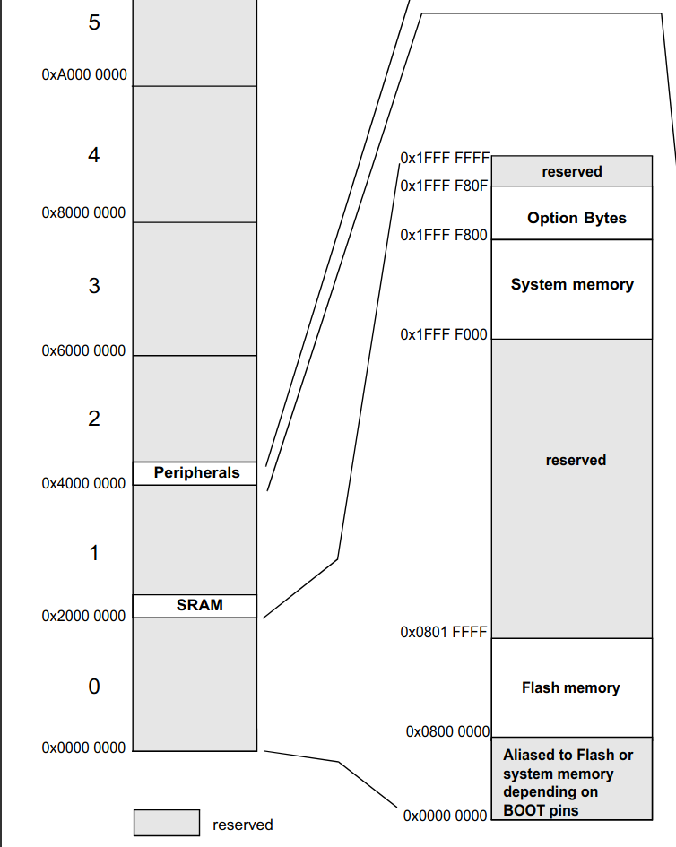

This diagram has the following memory maps defined:

1. The Flash section (code lives here) is mapped from `0x08000_0000` to `0x08001_FFFF`. This is where the code is supposed to be.
2. The SRAM section (your ram lives here) is mapped from `0x2000_0000`.
3. The peripherals (used for memory mapped IO, like serial output, GPIO, timers, etc.) is mapped from `0x4000_0000` to `0x4002_3400`.

First, the `.text` map has to be created in ghidra before running any form of analysis.

Start by opening the memory map manager and adding it to the memory maps.

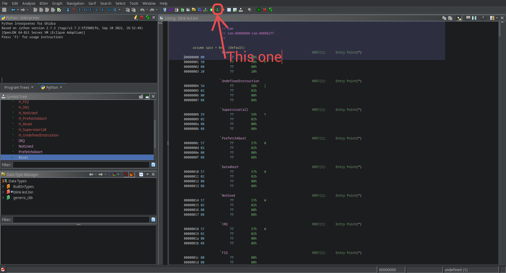

Create the memory map for the text section as follows:

1. Named `.text` (actually it can be anything, maybe `.code`?)
2. Starts at `0x08000_0000`.
3. Has a length `0x300` (same as the size of the `firmware`)
4. `File Bytes` block type, pointing to the firmware dump.

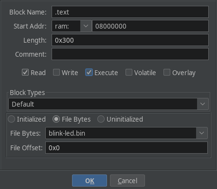

Once this is done, save the memory map and run analysis on the binary. This should reveal a lot of functions.

### Finding ~Nemo~ Main (and also .bss and .data)

In ELF binaries that link glibc, the main function is invoked by `__libc_start_main`.

But in reversing firmware, the approach is not straight-forward. It varies from one microcontroller to another.

In almost all microcontrollers, the `reset` interrupt is raised on power-up. It's like `_start` in `ELF` binaries.
The handler for almost all `interrupts` is defined in an `Interrupt Vector Table`, which is placed somewhere in flash memory. Again, we consult the [documentation](https://www.st.com/resource/en/programming_manual/pm0056-stm32f10xxx20xxx21xxxl1xxxx-cortexm3-programming-manual-stmicroelectronics.pdf).

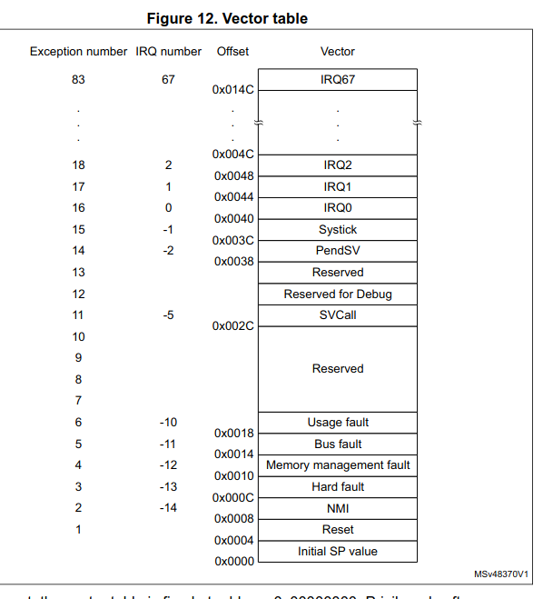

This is from the [programmer's manual, page 35](https://www.st.com/resource/en/programming_manual/pm0056-stm32f10xxx20xxx21xxxl1xxxx-cortexm3-programming-manual-stmicroelectronics.pdf).

In our case, the handler for the `reset` interrupt is defined as the second word in the firmware (ie, at `0x08000_0004`). We can jump to the handler by defining a pointer at  `0x08000_0004`, and double clicking on it.

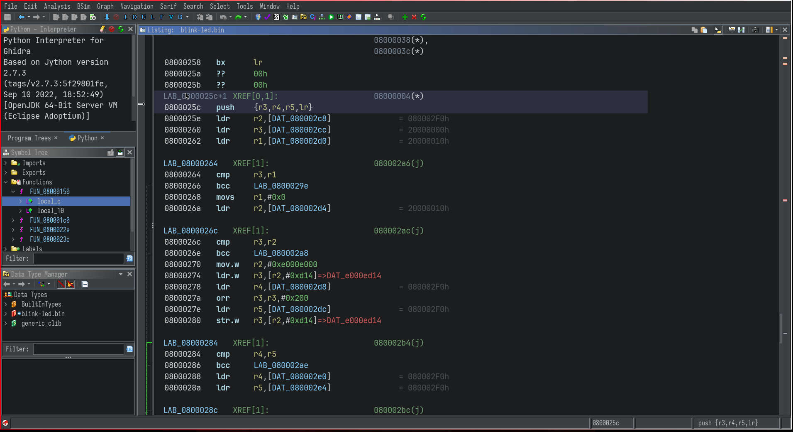

Try defining a function by pressing `f`. Now, after a little commenting, the function decompilation looks like so:

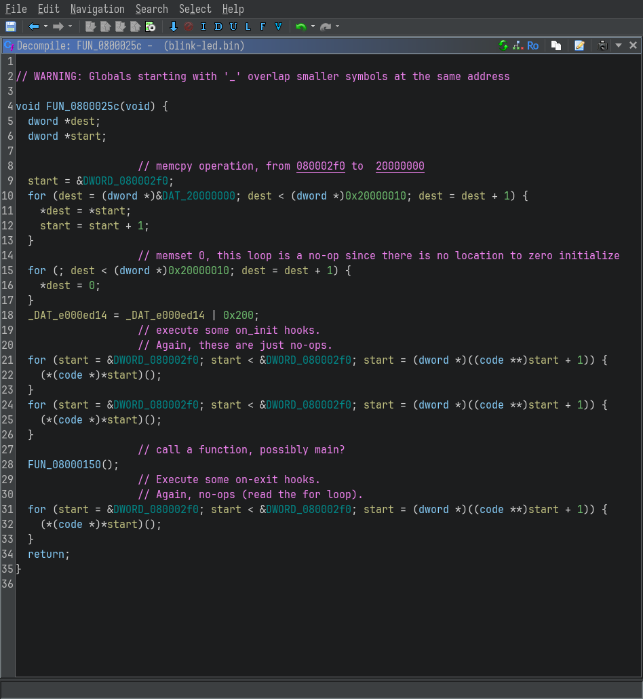

If you are familiar with the `ELF` file format, the two loops should be familiar to you.

1. The first loop is initializing the `.data` section (initialized data)
2. The second loop is initializing the `.bss` section (uninitialized, zero'd out data)

This is followed by a call to `FUN_08000150`, which should be something like `__libc_start_main`, or `main` itself.
Double click on it to inspect it.


### Mapping the .data and .bss sections

The first few lines of the disassembly of the `FUN_08000150` are:

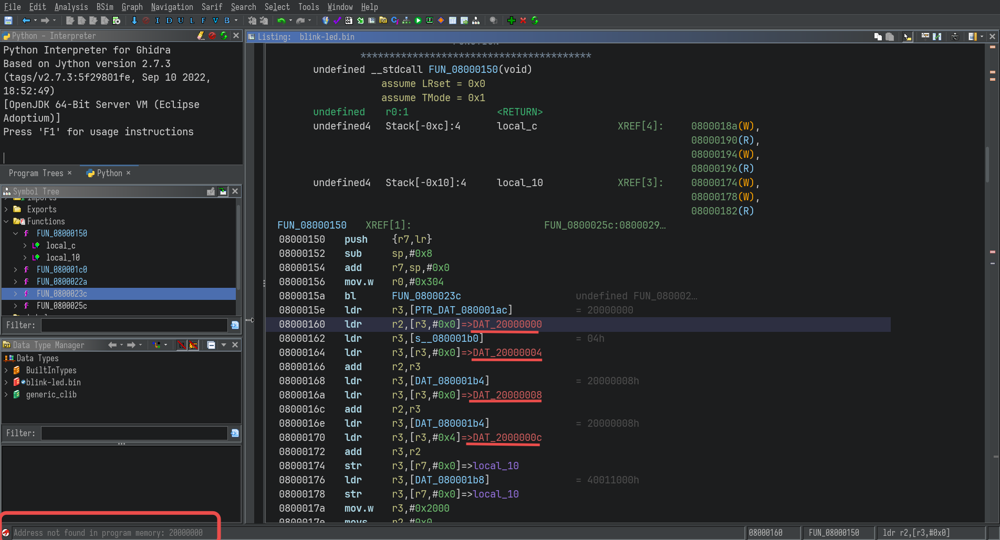

The undefined addresses are apparently global variables, usually found in the `.data` and `.text` sections in an `ELF`.

In order to access the values of these variables, they have to be mapped to the appropriate locations in memory.

Once again, open the memory map editor, and create a new mapping for the `.data` section:

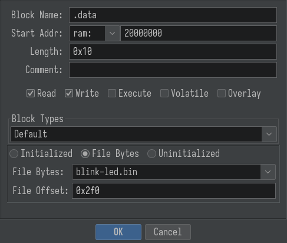

The values in the text fields are from the loops in the `reset` interrupt handler.

```c
start = &DWORD_080002f0;
for (dest = (dword *)&DAT_20000000; dest < (dword *)0x20000010; dest = dest + 1) {
    *dest = *start;
    start = start + 1;
}
```

If you are not familiar with C, this is what the loop is doing:

> `0x08000_02f0` contains the start of the initialized data.
> for <u>0x10</u> loop iterations, copy the data from `0x08000_02f0`  to `0x2000_0000`

From the above loop, it is inferred that there is initialized data at offset `0x02f0` of length `0x10`.

After creating the map and saving it, the references in the disassembly become valid.

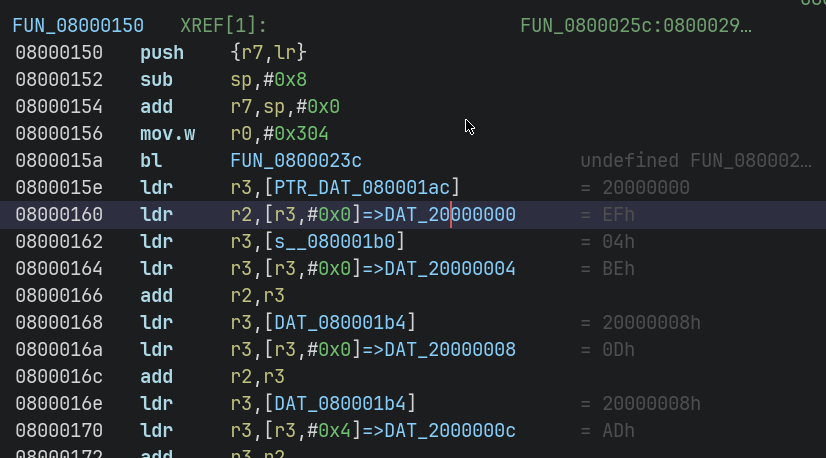

Double clicking them even shows the actual value of the corresponding global variables :

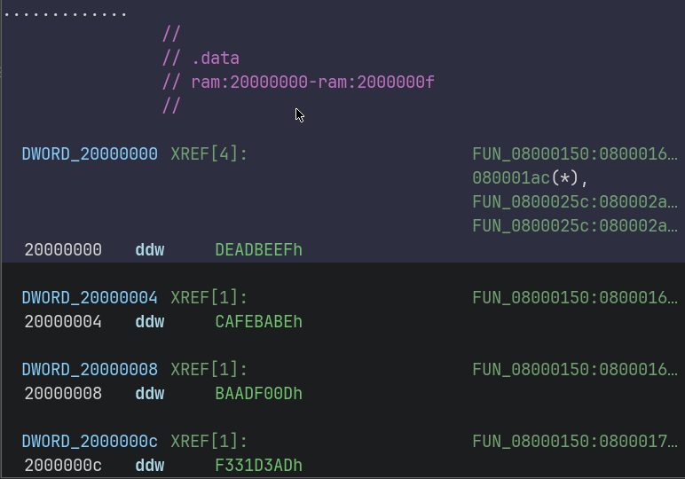

### Memory Mapped IO

This part is optional, and is not necessary for most CTF challenges - you'll mostly focus on user code, and the algorithms it contain.
But while reversing firmware dumps from actualy devices, like routers, it'll be very helpful to understand what memory mapped operation is being performed.

This part is much more complicated, as it involves creating mappings for each and every peripheral that is referenced in the code.

There is an easier alternative for supported boards, which ship with a `SVD` (`System View Description`) file in it's documentation. Fortunately, the STM32F101C8 does have an svd file,which can be imported into ghidra with the plugin [SVD-Loader-Ghidra](https://github.com/leveldown-security/SVD-Loader-Ghidra).

## Conclusion

We started with a raw firmware dump and step by step reconstructed its structure inside Ghidra: flash code, reset handler, .data and .bss, and even hints of memory-mapped peripherals. With these foundations, you can begin exploring higher-level logic in real firmware, whether that’s simple LED blinking or complex networking stacks.

In future posts, I’ll look at analyzing real-world firmware from devices like routers, where these same techniques apply but the codebase is much larger and more complex.
