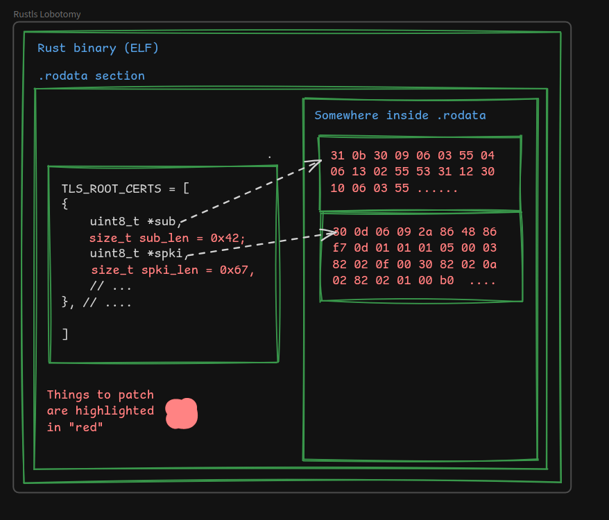
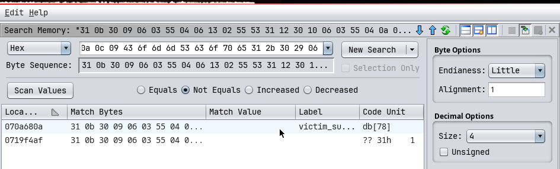
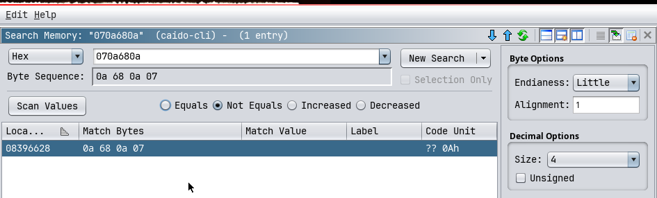
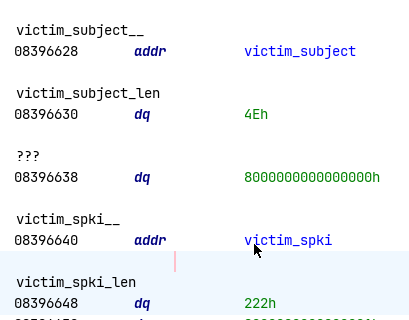
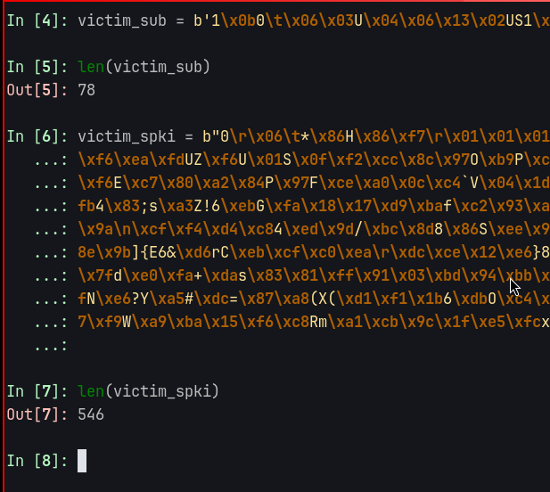

Giving `rustls` a gentle lobotomy and make it cooperate with the HTTP/S your proxy of choice :).

<!--more-->

## TL;DR

1.  Extract `SubjectPublicKeyInfo` and `Subject` from your CA cert.
2.  Find a victim CA Certificate with appropriately long `subject` and `subject_public_key_info` from (webpki-roots)[https://github.com/rustls/webpki-roots/blob/main/webpki-roots/src/lib.rs].
3.  Replace the victim CA Certificate with your target CA Cert.
4.  Patch the length fields of the `subject_public_key_info` and `subject` fields appropriately.

Skip to [The patch script](#script).

## Introduction

When testing thick-client applications, adding an HTTP/S proxy makes it much easier to see the API calls being made and how the app talks to the network.

That said, adding a proxy isn't always as simple as flipping a switch. How easy (or painful) it is depends on the application itself-how it's configured, which libraries it uses, and how its networking stack is wired together.

In this post, we'll take a look at introducing a HTTP proxy to a rust application that uses [**rustls**](https://rustls.dev/) for it's TLS implementation.

## How to inject a proxy

Injecting a proxy for rust applications that use the `reqwest` library is simple - you just set the `ALL_PROXY` environment variable (a de facto standard recegonized by many tools, including `libcurl` and friends.).

But this creates a new problem - the Proxy Application uses a non-standard TLS certificate for encrypting the traffic, which is NOT SIGNED BY A RECEGONIZED Certificate Authority. The result is error messages like this:

```
2025-12-17T18:17:16.625000Z  WARN main service|cloud: Unable to communicate alive to the cloud: Unavailable(error sending request
Caused by:
    0: client error (Connect)
    1: invalid peer certificate: UnknownIssuer)
```

To fix this, we have to add the Proxy Application's CA Certificate to the database of certificates our binary trusts.


## Rustls Root Certs

`Rustls` does not uses the underlying OS's certificate store for verifying certificates. It instead embeds it's copy of root CA's into the binary itself (in the variable [TLS_SERVER_ROOTS](https://github.com/rustls/webpki-roots/blob/main/webpki-roots/src/lib.rs#L38)).

It does not actually store the entire certificate in a `DER` or `PEM` format. Instead, it [fetches the latest CA certs trusted by mozilla at compile time](https://github.com/rustls/webpki-roots/blob/main/webpki-roots/tests/codegen.rs), and extracts just two fields out of the `PEM` certificate.

## Patching in the CA Cert

### What to patch

The TLS_SERVER_ROOTS variable is a slice of TrustAnchor structs, which contains data in the format:

```rust

pub const TLS_SERVER_ROOTS: &[TrustAnchor<'static>] = &[
  /*
   * -----BEGIN CERTIFICATE-----
   * MIICGTCCAZ+gAwIBAgIQCeCTZaz32ci5PhwLBCou8zAKBggqhkjOPQQDAzBOMQsw
   * --------------- snip ---------------
   * DXZDjC5Ty3zfDBeWUA==
   * -----END CERTIFICATE-----
   */

  TrustAnchor {
    subject: Der::from_slice(b"1\x0b ....  DigiCert TLS ECC P384 Root G5"),
    subject_public_key_info: Der::from_slice(b"0\x10\x06\x07*\x86H ............. \xa0\x8e\xf5T\xe7\x95\xc9"),
    name_constraints: None
  },
  // ... --------------- snip ---------------
]
```

To inject our web proxy's CA Cert into the application's CA Database, we just have to patch the `subject` and `subject_public_key_info` bytes, and their length fields.

The below diagram is a rough representation of what we'll be doing:




#### Patching `subject` and `subject_public_key_info`

Patching the `subject` and `subject_public_key_info` is as simple as a `bytes.replace` invocation in python - with added padding.

Padding is needed to ensure that the virtual address offsets inside the target binary stays valid even after patching the binary.

```py
proxyca_sub, proxyca_spki = get_subject_spki(proxy_ca)

assert len(victim_sub) >= len(proxyca_sub)
assert len(victim_spki) >= len(proxyca_spki)

proxyca_sub_padded = proxyca_sub + b"\x00" * (len(victim_sub) - len(proxyca_sub))
proxyca_spki_padded = proxyca_spki + b"\x00" * (len(victim_spki) - len(proxyca_spki))

elf_bytes = bytearray(read(elf_cli_elf))
elf_bytes = elf_bytes.replace(victim_sub, proxyca_sub_padded)
elf_bytes = elf_bytes.replace(victim_spki, proxyca_spki_padded)
```

#### Patching the length of `subject` and `subject_public_key_info`

The rust type of the `subject` and `subject_public_key_info` fields is `&[u8]`, which has the following C struct layout:

```c
struct sliceOfu8 {
    uint8_t *buf; // this points to the `.rodata` section
    size_t *len; // this is the length of the buf
}
```

If our proxy's CA cert is of the same length as the victim CA Cert, there is no need to patch the `len` field. But it is not always the case - so the length field has to be corrected.

In order to find the appropriate offsets, open the binary in your favorite reverse engineering tool. I will use [**ghidra**](https://github.com/NationalSecurityAgency/ghidra).

Then, do a byte sequence search of your victim `subject` and `spki`, to find the PIE Offsets.



Surprisingly, it contains not one but two results - which means we should replace every single occurence.

The result contains the following PIE Offsets:
```
0x070a680a
0x0719f4af
```

Start a second search with this RVA as the search query



Navigate to the location in ghidra, and replicate the layout of the `sliceOfu8` struct.



Verify the discovered length with the length in the source code:



Copy the `Bytesource Offsets` of the two lengths which will be used for patching later.

```py
victim_spki_len_loc = 0x8096648
victim_sub_len_loc = 0x8096630

# We use the unpadded length here.
elf_bytes[victim_spki_len_loc:][:8] = p64(len(proxyca_spki))
elf_bytes[victim_sub_len_loc:][:8] = p64(len(proxyca_sub))
```

## Script

```py
from shlex import quote
from pwn import *

from cryptography import x509
from cryptography.hazmat.primitives import serialization


proxy_ca = args.PROXY_CA or "./caido.pem"
caido_cli_elf = args.ORIG or "./caido-cli"
patched_elf = args.PATCHED or "./caido-cli-patched"

# Patch victim subject
victim_sub = b'1\x0b0\t\x06\x03U\x04\x06\x13\x02US1\x120\x10\x06\x03U\x04\n\x0c\tCommScope1+0)\x06\x03U\x04\x03\x0c"CommScope Public Trust RSA Root-01'
# Patch victim spki
victim_spki = b"0\r\x06\t*\x86H\x86\xf7\r\x01\x01\x01\x05\x00\x03\x82\x02\x0f\x000\x82\x02\n\x02\x82\x02\x01\x00\xb0He\xa3\r\x1dB\xe3\x91m\x9d\x84\xa4a\x96\x12\xc2\xed\xc3\xda#4\x19v\xf6\xea\xfdUZ\xf6U\x01S\x0f\xf2\xcc\x8c\x97O\xb9P\xcb\xb3\x01DV\x96\xfd\x9b(\xec{t\x0b\xe7BkU\xce\xc9a\xb2\xe8\xad@<\xba\xb9A\n\x05O\x1b&\x85\x8fC\xb5@\xb5\x85\xd1\xd4q\xdc\x83A\xf3\xf6E\xc7\x80\xa2\x84P\x97F\xce\xa0\x0c\xc4`V\x04\x1d\x07[F\xa5\x0e\xb2K\xa4\x0e\xa5|\xee\xf8\xd4b\x03\xb9\x93j\x8a\x14\xb8p\xf8.\x82F8#\x0et\xc7kA\xb7\xd0)\xa3\x9d\x80\xb0~w\x93cB\xfb4\x83;s\xa3Z!6\xebG\xfa\x18\x17\xd9\xbaf\xc2\x93\xa4\x8f\xfc]\xa4\xad\xfcPj\x95\xac\xbc$3\xd1\xbd\x88\x7f\x86\xf5\xf5\xb2s*\x8f|\xaf\x08\xf2\x1a\x98?\xa9\x81e?\xc1\x8c\x89\xc5\x960\x9a\n\xcf\xf4\xd4\xc84\xed\x9d/\xbc\x8d8\x86S\xee\x97\x9f\xa9\xb2c\x94\x17\x8d\x0f\xdcf*|RQu\xcb\x99\x8e\xe8=\\\xbf\x9e;(\x8d\x83\x02\x0f\xa9\x9fr\xe2,+\xb3\xdcf\x97\x00@\xd0\xa4T\x8e\x9b]{E6&\xd6rC\xeb\xcf\xc0\xea\r\xdc\xce\x12\xe6}8\x9f\x05'\xa8\x97>\xe9Q\xc6l\x05(\xc1\x02\x0f\xe9\x18m\xec\xbd\x9c\x06\xd4\xa7I\xf4T\x05kl0\xf1\xeb\x03\xd5\xea=jv\xc2\xcb\x1a(IM\x7fd\xe0\xfa+\xdas\x83\x81\xff\x91\x03\xbd\x94\xbb\xe4\xb8\x8e\x9c2c\xcd\x9f\xbbh\x81\xb1\x84[\xaf6\xbfw\xee\x1d\x7f\xf7I\x9bR\xec\xd2wZ}\x91\x9dM\xc29-\xe4\xba\x82\xf8o\xf2N\x1e\x0fN\xe6?Y\xa5#\xdc=\x87\xa8(X(\xd1\xf1\x1b6\xdbO\xc4\xff\xe1\x8c[r\x8c\xc7&\x03'\xa39\n\x01\xaa\xc0\xb21`\x83\"\xa1O\x12\t\x01\x11\xaf4\xd4\xcf\xd7\xaeb\xd3\x05\x07\xb41u\xe0\rmWOi\x87\xf9W\xa9\xba\x15\xf6\xc8Rm\xa1\xcb\x9c\x1f\xe5\xfcx\xa85\x9a\x9fA\x14\xce\xa5\xb4\xce\x94\x08\x1c\t\xadV\xe5\xda\xb6I\x9aJ\xeac\x18S\x9c,.\xc3\x02\x03\x01\x00\x01"


# WARN: SlopGen'd
def strip_der_tlv(der: bytes) -> bytes:
    """
    Strip the outer ASN.1 DER TLV and return the VALUE.
    Assumes the object is a single TLV (e.g., SEQUENCE).
    """
    if len(der) < 2:
        raise ValueError("DER too short")

    tag = der[0]
    if tag != 0x30:
        raise ValueError(f"Unexpected DER tag: {tag:#x}")

    first_len = der[1]

    # Short form length
    if first_len < 0x80:
        length = first_len
        header_len = 2
    else:
        # Long form length
        num_len_bytes = first_len & 0x7F
        if num_len_bytes == 0 or num_len_bytes > 4:
            raise ValueError("Invalid DER length encoding")

        length = int.from_bytes(der[2 : 2 + num_len_bytes], "big")
        header_len = 2 + num_len_bytes

    value = der[header_len : header_len + length]

    if len(value) != length:
        raise ValueError("DER length mismatch")

    return value


def get_subject_spki(pem_path):
    with open(pem_path, "rb") as f:
        pem_data = f.read()
    cert = x509.load_pem_x509_certificate(pem_data)
    subject = cert.subject.public_bytes(serialization.Encoding.DER)
    subject = strip_der_tlv(subject)

    spki = cert.public_key().public_bytes(
        encoding=serialization.Encoding.DER,
        format=serialization.PublicFormat.SubjectPublicKeyInfo,
    )
    spki = strip_der_tlv(spki)

    return (subject, spki)


proxyca_sub, proxyca_spki = get_subject_spki(proxy_ca)

assert len(victim_sub) >= len(proxyca_sub)
assert len(victim_spki) >= len(proxyca_spki)

proxyca_sub_padded = proxyca_sub + b"\x00" * (len(victim_sub) - len(proxyca_sub))
proxyca_spki_padded = proxyca_spki + b"\x00" * (len(victim_spki) - len(proxyca_spki))

caido_bytes = bytearray(read(caido_cli_elf))
caido_bytes = caido_bytes.replace(victim_sub, proxyca_sub_padded)
caido_bytes = caido_bytes.replace(victim_spki, proxyca_spki_padded)

victim_spki_len_loc = 0x8096648
victim_sub_len_loc = 0x8096630

info( "before patching sub length - spki:  %#x" % u64(caido_bytes[victim_sub_len_loc:][:8]))
info( "before patching spki length - sub: %#x" % u64(caido_bytes[victim_spki_len_loc:][:8]))


caido_bytes[victim_spki_len_loc:][:8] = p64(len(proxyca_spki))
caido_bytes[victim_sub_len_loc:][:8] = p64(len(proxyca_sub))

info( "after  patching sub length - spki:  %#x" % u64(caido_bytes[victim_sub_len_loc:][:8]))
info( "after  patching spki length - sub: %#x" % u64(caido_bytes[victim_spki_len_loc:][:8]))

write(patched_elf, bytes(caido_bytes))
os.system("chmod +x %s" % (quote(patched_elf)))
```

## Conclusion

This technique applies to any Rust project that relies on rustls for TLS. If a project uses a different TLS stack, binary patching may not be necessary at all. Understanding the underlying architecture is essential when attempting to bypass these protections.
