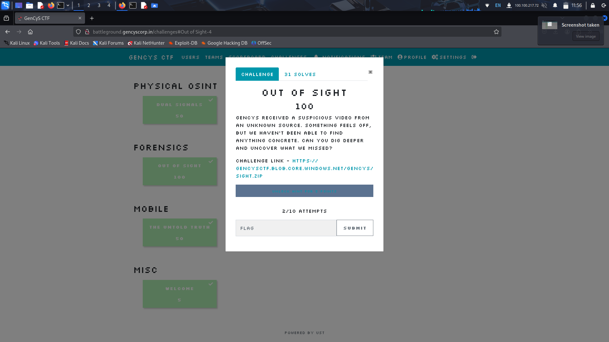
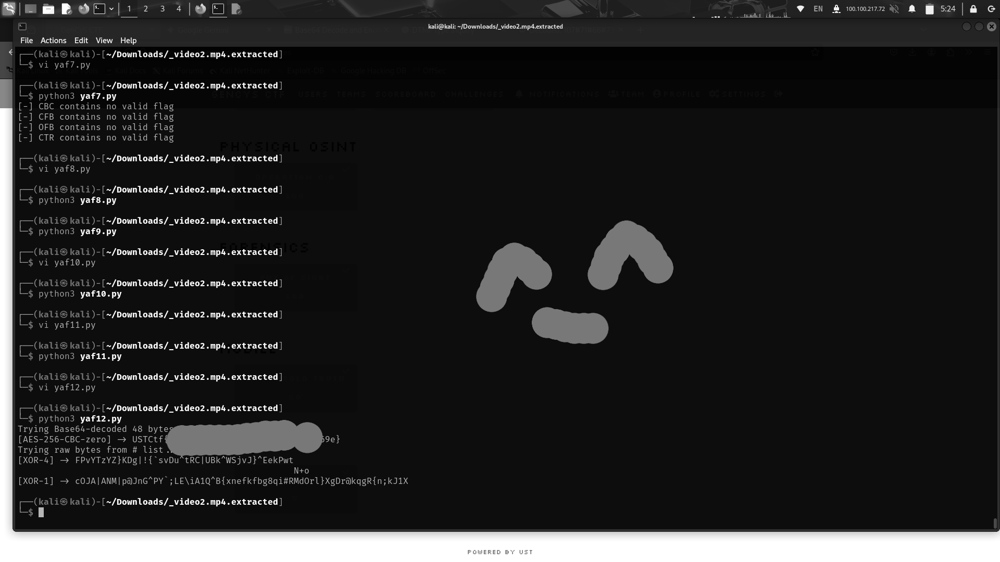

30 mins of cursor tracking and noice cancellation - cause automating it is slower :pray:..

P.S.: mp4 -> DTMF -> ciphertext -> AES Decrypt

<!--more-->




## Description

GenCys received an suspicious video from an unknown source . Something's been off , but we havent been able to find anything concrete . Can you dig deeper and uncover what we missed.


## Solve

In this challenge , We have 2 .mp4 files , Video1.mp4 and video2.mp4 files
When seeing the video , we get the idea that it is an AES-256 decoding challenge , but the chall is under forensics , so therefore we need to find the ciphertext and the key from these 2 videos.

### Strings coz we can and we should

Using strigns on the second video reveals a comfortably `32 byte` text, which is exactly what AES 256 needs.

### Desperate measures

Video2.mp4 is 30 minutes long, and we had two choices moving forward:
1. Automate it with opencv / yolo object tracking.
2. Manually watch 30 minuetes of cursor tracking.

Naturally, we decided to solve the challenge the god intended way, and started watching the 30 mins video - only to give up a few minutes later.

Out of curiosity, we tried converting the video to wav, hoping to get any leads - and we ACTUALLY got one DTMF encoded ciphertext.

### Decryption

Make ChatGPT generate a long aah script that does dtmf decode and common decryption techniques (Even though I clearly mentioned only AES-256)

**and voila flag is revealed...**

```py
# file: yap.py
import hashlib, string, io, zlib, gzip, sys
from base64 import b64decode
from Crypto.Cipher import AES, DES3, ARC4, ChaCha20_Poly1305
from Crypto.Util.Padding import unpad
from Crypto.Protocol.KDF import scrypt, PBKDF2

nums = "107#71#66#73#116#73#70#69#116#120#72#66#102#79#86#88#81#104#51#68#77#84#97#73#57#89#86#74#115#112#102#109#110#99#110#106#111#48#121#97#43#90#69#108#71#122#100#117#80#111#76#122#72#99#121#111#90#115#102#51#99#66#57#80"
key_str = "23872947523978598732495873289321"

# Decode path A: numbers -> ASCII -> Base64 -> bytes
raw_ascii = bytes(int(x) for x in nums.split('#'))
try:
    ascii_str = raw_ascii.decode('ascii')
except:
    ascii_str = ''
try:
    ct_b64 = b64decode(ascii_str)
except:
    ct_b64 = b''

# Decode path B: treat numbers directly as bytes ciphertext
ct_raw = raw_ascii

def is_printable(bs):
    s = bs.decode('utf-8', errors='ignore')
    ratio = sum(c in string.printable for c in s) / max(1, len(s))
    return ratio > 0.95

def looks_flag(bs):
    s = bs.decode('utf-8', errors='ignore')
    return any(t in s for t in ['flag{','FLAG{','ctf{','CTF{','HTB{','picoCTF{','inctf{','shaktictf{']) or (is_printable(bs) and '{' in s and '}' in s and len(s) <= 200)

def emit(tag, data):
    if data is None: return
    if looks_flag(data):
        s = data.decode('utf-8', errors='ignore')
        print(f"[{tag}] -> {s}")

def dec_to_bytes(dec_str, length=None):
    n = int(dec_str)
    b = n.to_bytes((n.bit_length()+7)//8 or 1, 'big')
    if length:
        if len(b) < length: b = b'\x00'*(length-len(b)) + b
        else: b = b[-length:]
    return b

def to_bcd(dec_str):
    # each digit -> nibble
    ds = dec_str
    if len(ds) % 2 == 1: ds = '0'+ds
    out = bytearray()
    for i in range(0,len(ds),2):
        out.append(((ord(ds[i]) - 48) << 4) | (ord(ds[i+1]) - 48))
    return bytes(out)

def evp_bytes_to_key(passphrase, salt=b'\x00'*8, key_len=16, iv_len=16, md=hashlib.md5, count=1):
    d = b''
    prev = b''
    while len(d) < key_len + iv_len:
        prev = md(prev + passphrase + salt).digest()
        for _ in range(1, count):
            prev = md(prev).digest()
        d += prev
    return d[:key_len], d[key_len:key_len+iv_len]

# Build key materials
ascii_key = key_str.encode()
rev_ascii_key = key_str[::-1].encode()
dec_bytes_16 = dec_to_bytes(key_str, 16)
dec_bytes_24 = dec_to_bytes(key_str, 24)
dec_bytes_32 = dec_to_bytes(key_str, 32)
rev_dec_bytes_16 = dec_to_bytes(key_str[::-1], 16)
bcd = to_bcd(key_str)

key_materials = [
    ('ascii', ascii_key),
    ('ascii_rev', rev_ascii_key),
    ('dec16', dec_bytes_16),
    ('dec24', dec_bytes_24),
    ('dec32', dec_bytes_32),
    ('dec16_rev', rev_dec_bytes_16),
    ('bcd', bcd),
]
# hashed forms
def km_hash(tag, b):
    return [
        (tag+'-md5', hashlib.md5(b).digest()),
        (tag+'-sha1_16', hashlib.sha1(b).digest()[:16]),
        (tag+'-sha256_16', hashlib.sha256(b).digest()[:16]),
        (tag+'-sha256_32', hashlib.sha256(b).digest()),
    ]

all_keys = []
for tag, km in key_materials:
    all_keys.append((tag, km))
    all_keys.extend(km_hash(tag, km))

# Candidate ciphertext sets
ciphersets = [('b64', ct_b64), ('raw', ct_raw)]

def try_aes_blocks(ct, key16, key32):
    # ECB
    if key16:
        try: emit('AES-128-ECB', unpad(AES.new(key16, AES.MODE_ECB).decrypt(ct), 16))
        except: pass
    if key32:
        try: emit('AES-256-ECB', unpad(AES.new(key32, AES.MODE_ECB).decrypt(ct), 16))
        except: pass
    # CBC zero IV and IV-prefixed/suffixed
    for ivpos in ['zero','pref16','suf16']:
        if ivpos == 'zero':
            iv = b'\x00'*16; data = ct
        elif ivpos == 'pref16' and len(ct) > 16:
            iv, data = ct[:16], ct[16:]
        elif ivpos == 'suf16' and len(ct) > 16:
            iv, data = ct[-16:], ct[:-16]
        else:
            continue
        if key16:
            try: emit(f'AES-128-CBC-{ivpos}', unpad(AES.new(key16, AES.MODE_CBC, iv=iv).decrypt(data), 16))
            except: pass
        if key32:
            try: emit(f'AES-256-CBC-{ivpos}', unpad(AES.new(key32, AES.MODE_CBC, iv=iv).decrypt(data), 16))
            except: pass
    # CFB/OFB/CTR
    for ivpos in ['zero','pref16','suf16']:
        if ivpos == 'zero':
            iv = b'\x00'*16; data = ct
        elif ivpos == 'pref16' and len(ct) > 16:
            iv, data = ct[:16], ct[16:]
        elif ivpos == 'suf16' and len(ct) > 16:
            iv, data = ct[-16:], ct[:-16]
        else:
            continue
        for label, key in [('128',key16), ('256',key32)]:
            if not key: continue
            try:
                pt = AES.new(key, AES.MODE_CFB, iv=iv, segment_size=128).decrypt(data)
                if looks_flag(pt): emit(f'AES-{label}-CFB-{ivpos}', pt)
            except: pass
            try:
                pt = AES.new(key, AES.MODE_OFB, iv=iv).decrypt(data)
                if looks_flag(pt): emit(f'AES-{label}-OFB-{ivpos}', pt)
            except: pass
            try:
                from Crypto.Util import Counter
                init = int.from_bytes(iv, 'big')
                ctr = Counter.new(128, initial_value=init)
                pt = AES.new(key, AES.MODE_CTR, counter=ctr).decrypt(data)
                if looks_flag(pt): emit(f'AES-{label}-CTR-{ivpos}', pt)
            except: pass

def try_aead(ct, key16, key32):
    # AES-GCM/ChaCha20-Poly1305 with nonce prefix and tag suffix
    for noncelen in [12,16]:
        for taglen in [16]:
            if len(ct) > noncelen + taglen + 1:
                nonce = ct[:noncelen]
                tag = ct[-taglen:]
                data = ct[noncelen:-taglen]
                if key16:
                    try:
                        pt = AES.new(key16, AES.MODE_GCM, nonce=nonce).decrypt_and_verify(data, tag)
                        emit(f'AES-128-GCM-n{noncelen}', pt)
                    except: pass
                if key32:
                    try:
                        pt = AES.new(key32, AES.MODE_GCM, nonce=nonce).decrypt_and_verify(data, tag)
                        emit(f'AES-256-GCM-n{noncelen}', pt)
                    except: pass
                for key in [key16, key32]:
                    if not key: continue
                    try:
                        ch = ChaCha20_Poly1305.new(key=key, nonce=nonce)
                        pt = ch.decrypt_and_verify(data, tag)
                        emit(f'ChaCha20-Poly1305-n{noncelen}', pt)
                    except: pass

def try_evp(ct, passbytes):
    # OpenSSL MD5 EVP_BytesToKey, zero salt
    for klen in [16,32]:
        key, iv = evp_bytes_to_key(passbytes, salt=b'\x00'*8, key_len=klen, iv_len=16, md=hashlib.md5, count=1)
        try:
            pt = unpad(AES.new(key, AES.MODE_CBC, iv=iv).decrypt(ct), 16)
            emit(f'EVP_MD5_AES{klen*8}-CBC', pt)
        except: pass
        # try iv-prefixed/suf16 variants for robustness
        if len(ct) > 16:
            ivp, data = ct[:16], ct[16:]
            try:
                pt = unpad(AES.new(key, AES.MODE_CBC, iv=ivp).decrypt(data), 16)
                emit(f'EVP_MD5_AES{klen*8}-CBC-ivpref', pt)
            except: pass
            ivs, data = ct[-16:], ct[:-16]
            try:
                pt = unpad(AES.new(key, AES.MODE_CBC, iv=ivs).decrypt(data), 16)
                emit(f'EVP_MD5_AES{klen*8}-CBC-ivsuf', pt)
            except: pass

def try_others(ct, keybytes):
    # 3DES ECB/CBC
    cands = [
        hashlib.md5(keybytes).digest()*2,
        hashlib.sha1(keybytes).digest()+b'\x00'*4,
        hashlib.sha256(keybytes).digest(),
    ]
    for raw in cands:
        try:
            dk = DES3.adjust_key_parity(raw[:24])
        except:
            continue
        try: emit('3DES-ECB', unpad(DES3.new(dk, DES3.MODE_ECB).decrypt(ct), 8))
        except: pass
        try: emit('3DES-CBC-zero', unpad(DES3.new(dk, DES3.MODE_CBC, iv=b'\x00'*8).decrypt(ct), 8))
        except: pass
        if len(ct) > 8:
            iv, data = ct[:8], ct[8:]
            try: emit('3DES-CBC-ivpref', unpad(DES3.new(dk, DES3.MODE_CBC, iv=iv).decrypt(data), 8))
            except: pass
    # RC4
    for k in [keybytes, hashlib.md5(keybytes).digest(), hashlib.sha1(keybytes).digest(), hashlib.sha256(keybytes).digest()]:
        try:
            out = ARC4.new(k).decrypt(ct)
            if looks_flag(out): emit('RC4', out)
        except: pass
    # XOR rep
    for k in [hashlib.sha256(keybytes).digest()[:l] for l in [1,2,3,4,8,16,32]]:
        out = bytes(c ^ k[i % len(k)] for i, c in enumerate(ct))
        if looks_flag(out): emit(f'XOR-{len(k)}', out)
    # Decompression
    try: emit('zlib', zlib.decompress(ct))
    except: pass
    try:
        import gzip, io
        emit('gzip', gzip.GzipFile(fileobj=io.BytesIO(ct)).read())
    except: pass
    # Double Base64
    try:
        out = b64decode(ct)
        if looks_flag(out): emit('double-b64', out)
    except: pass

def run_all(tag, ct):
    # Iterate key materials
    for km_tag, km in all_keys:
        key16 = km if len(km)==16 else None
        key32 = km if len(km)==32 else None
        # If not 16/32, try hashed forms to 16/32
        if not key16:
            key16 = hashlib.md5(km).digest()
        if not key32:
            key32 = hashlib.sha256(km).digest()
        try_aes_blocks(ct, key16, key32)

print("Trying Base64-decoded 48 bytes...")
run_all('b64', ct_b64)
print("Trying raw bytes from # list...")
run_all('raw', ct_raw)
```



## Flag

`USTCtf{REDACTED}`

Note: Flag redacted
