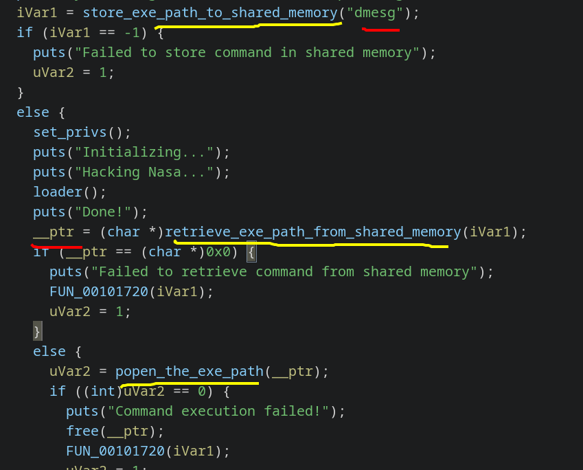
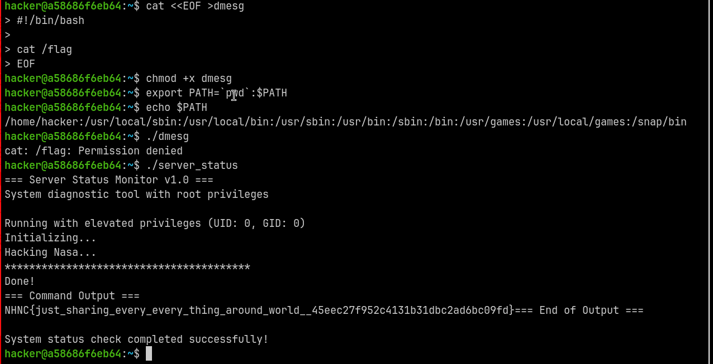
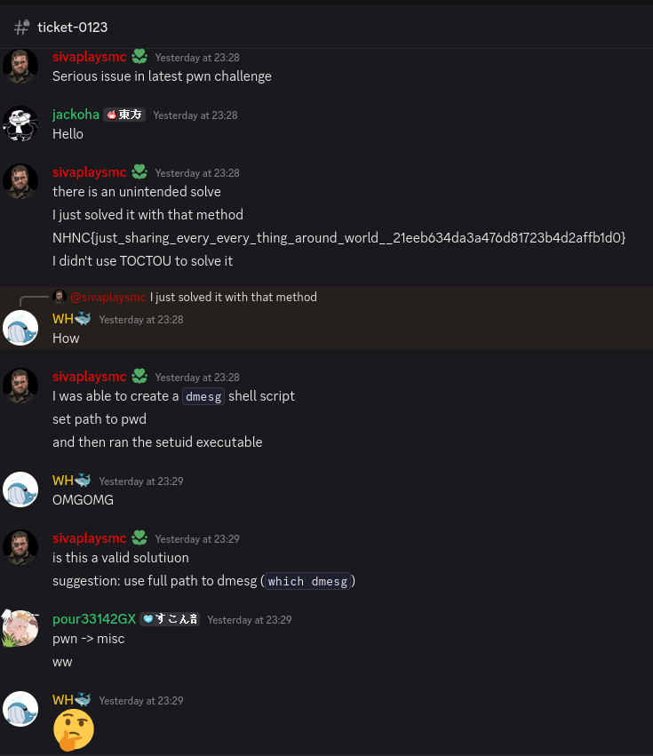
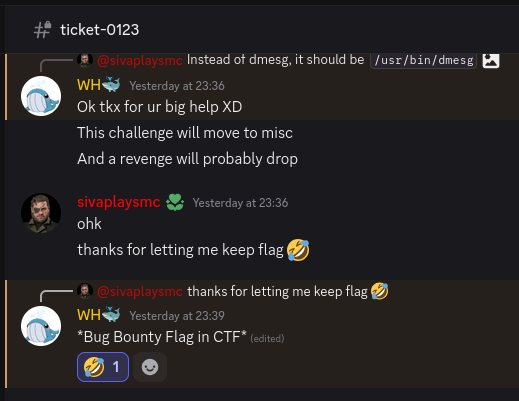

SUID Binary with relative path => recipie for disaster.

UN-INTENDED SOLVE, Notified organisers about it.

<!--more-->

## Initial Reverse engineering

On inspecting the challenge files in ghidra, something sticks out:

A **Relative path** is being passed to `popen`.

## Exploitation

This means I can create a dummy bash file called `dmesg`, update `PATH` variable to point to it, and execute it to get a root shell.

## Fixing the challenge

This clearly is an unintended solution, so I went ahead and created a ticket.

## Flag

`NHNC{just_sharing_every_every_thing_around_world__45eec27f952c4131b31dbc2ad6bc09fd}`
