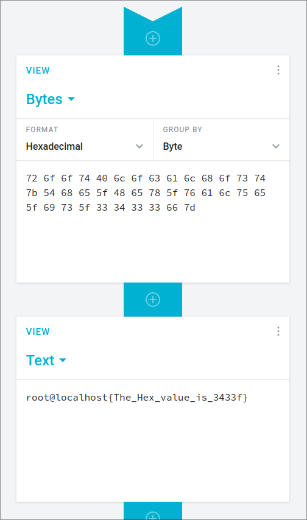

Why is there not a simple CLI tool for converting hex to ascii? :pray:

<!--more-->

## Statement

72 6f 6f 74 40 6c 6f 63 61 6c 68 6f 73 74 7b 54 68 65 5f 48 65 78 5f 76 61 6c 75 65 5f 69 73 5f 33 34 33 33 66 7d

## Solution

Decode the hex using [Cryptii](https://cryptii.com/pipes/hex-decoder)

## Flag: `root@localhost{The_Hex_value_is_3433f}`
