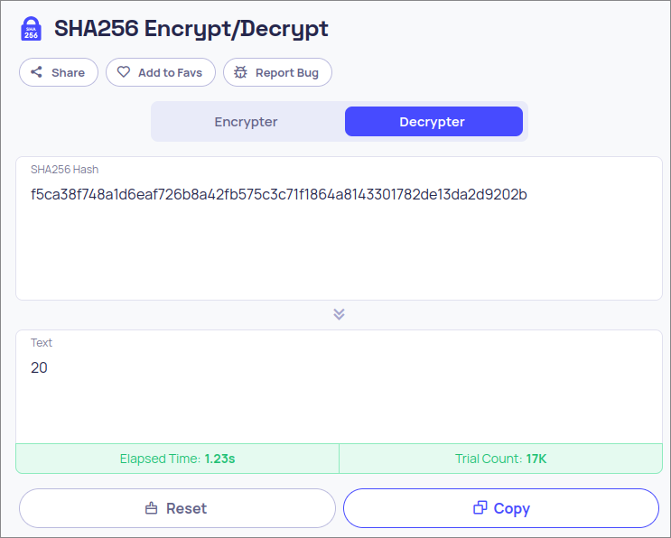

Cracking hashes like there's no tomorrow.

<!--more-->

## Solution

Given url

```bash
https://idoor-1.onrender.com/?camera=f5ca38f748a1d6eaf726b8a42fb575c3c71f1864a8143301782de13da2d9202b
```

The query paramaeter looks like a sha256 hash, try decrypting it with [This thingy](https://10015.io/tools/sha256-encrypt-decrypt)


Looks similar...


Put sha256 sum of zero in there (thank god we weren't taught one based indexing)

> [!Terminal]+ echo -n 0 | sha256sum
> 5feceb66ffc86f38d952786c6d696c79c2dbc239dd4e91b46729d73a27fb57e9  -
